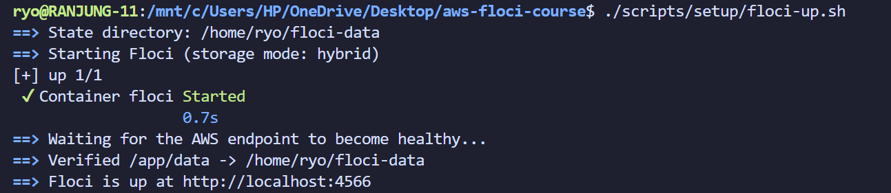
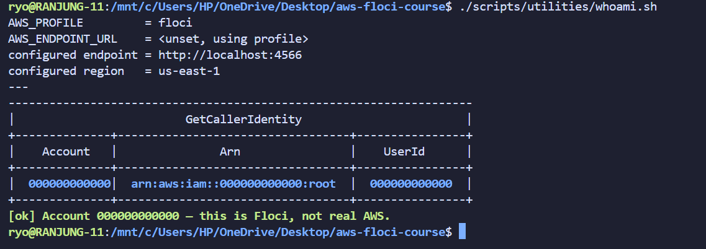
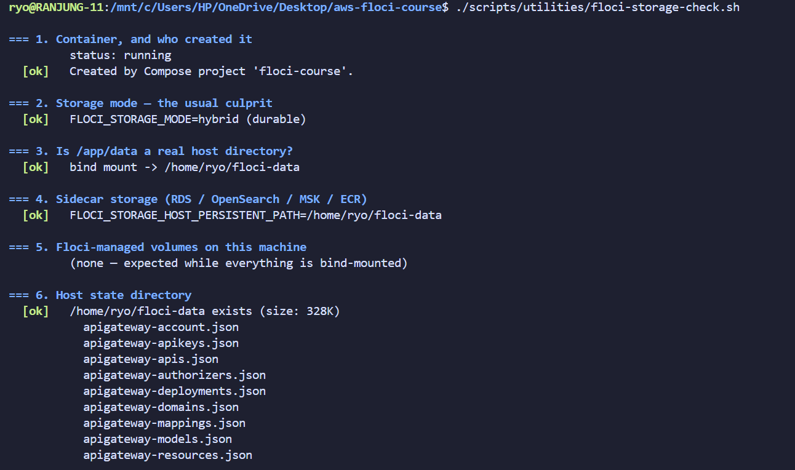
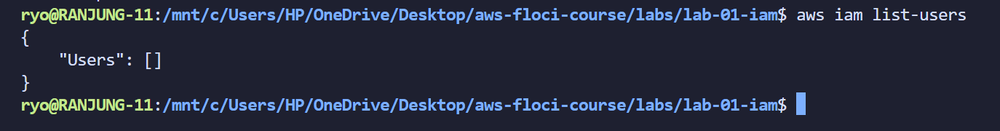
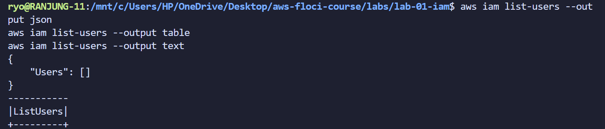
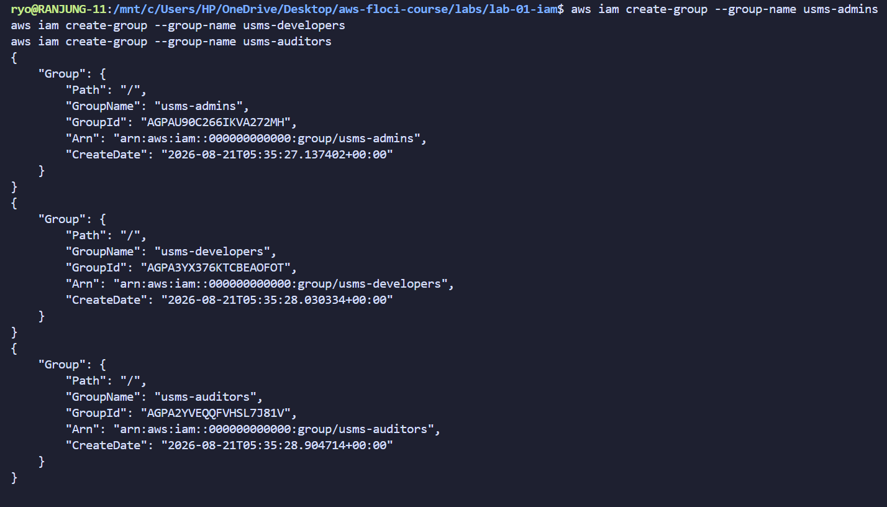
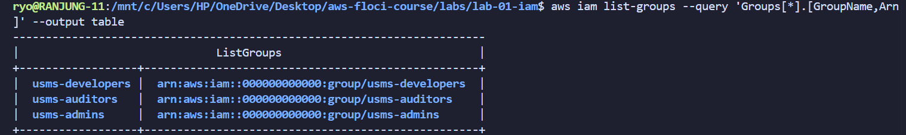
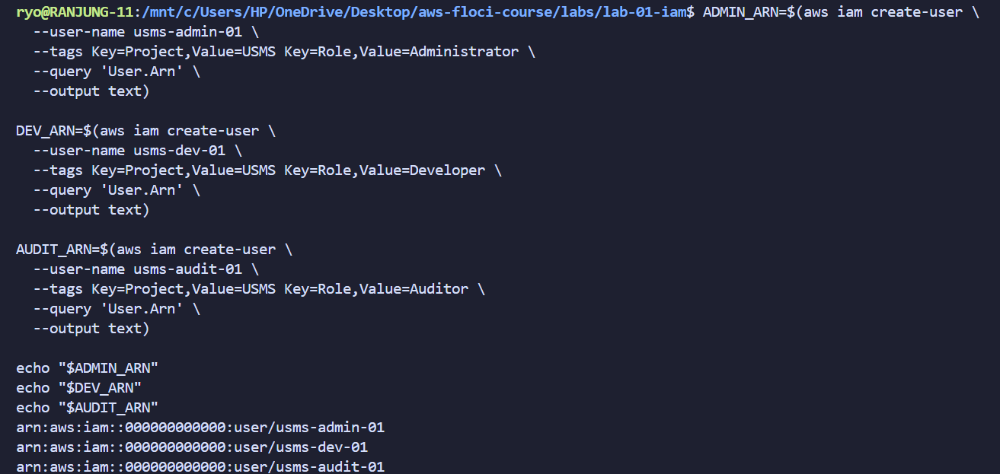
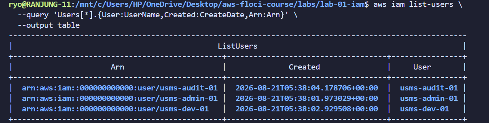
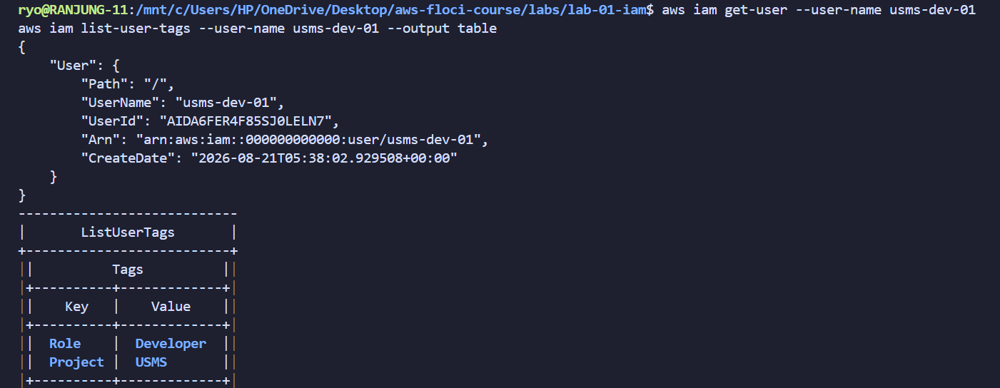

# Lab 1 Practical Report: Identity and Access Management (IAM)

## 1. Aim / Objective

The aim of this lab is to create and manage IAM users, groups, roles and policies using AWS CLI on local emulator floci and verify the access permissions of the created IAM users and groups.

## Introduction

IAM (Identity and Access Management) is a service that controls who can access the AWS resources and what actions they can perform. It's main purpose is to securely manage identities such as users, groups and roles and the permissions are defined through policies written in JSON format. IAM mainly provides security on AWS envirnoment, without this resources can be accessed and modified by unauthorized users. 

This lab is done on the local emulator floci which is a lightweight, open-source, and fully functional AWS cloud stack that allows developers to run and test their applications locally without the need for an actual AWS account.

## Use Case

IAM is used in an University. Example: A University is managing a cloud-based student management system using AWS IAM. Different users requires different levels of access based on their roles and responsibilities. 

Instead of giving every user full AWS permissions, the administrator create IAM group and assigns permissions according to each user's role. 

Every individual users are then assigned to the appropriate groups. An intern is also assigned to the auditors group with limited access, while specific roles are created for EC2 and Lambda services.

This approach follows the Principle of Least Privilege, this ensures that each user or service receives only the permissions required to perform its tasks.

## System Architecture / Design

Since this lab mainly focuses on crating IAM users, roles, groups and plolicies there is no specific system architecture or design required. Therefore, I have not included any architecture diagram in this report.

## Implementation Procedure

I have started this lab by preparing the local environment and installing required tools. Then I have organized the project structure and created neccessary files refering the lab instructions. On the initial phase I have created a .gitignore file to prevent sensitive files and credentials from being committed to Git. 

Floci was then started using docker compose with persistent storage through host bind mount. A dedicated AWS CLI profile was configured to connect to the local Floci endpoint, and both isolation from real AWS and data persistence after container restarts were verified. 

After the environment was set up, the IAM foundation was created. Three groups (usms-admins, usms-developers, and usms-auditors) were created and four users were created and they are assigned to appropriate groups. AWS managed and customer managed policies were created and attached to provide the required permissions, while one inline policy was applied directly to the developer user as a specific exception. EC2 and Lambda roles were also created with separate trust policies defining which services could assume them, along with a developer role for temporary access.

Finally, temporary credentials were obtained using sts assume-role, and a long-lived access key was generated and stored in the Git-ignored outputs/ directory. The IAM Policy Simulator was used to test the configured permissions and confirm that actions such as ec2:CreateVpc were denied while permitted actions such as ec2:DescribeVpcs were allowed.

## Results and Evidence

### Part A : Environment Setup

On the initial phase of the lab, I checked all the required tools and dependencies were installed and configured properly. I have also verified that the local Floci environment was running correctly and accessible through the AWS CLI.

All the required files and directories were created and organized as per the lab instructions. The .gitignore file was also created to prevent sensitive files from being committed to Git. 

Then I executed ./scripts/setup/floci-up.sh to start the Floci environment. The script also verified that the /app/data directory inside the container was backed by a host bind mount.

This was important because a bind mount allows the Floci data to persist outside the container.

Then I created a dedicated AWS CLI profile named floci and configured it to use the local Floci endpoint at http://localhost:4566. This ensured that subsequent AWS CLI commands could be directed to the local environment instead of the real AWS infrastructure.

Executed floci-storage-check.sh to validate the storage configuration. All diagnostic checks returned [ok], this confirms that the expected storage mode, bind mount, and host directory were correctly configured.

### Part B : Building the IAM Foundation

Here, I first checked the list of existing users and groups in the Floci environment.

The list is empty, this means ther is no users created right now.

Checked the existing roles also.

Same response, returned nothing.

**Created groups**

Created usms-admins, usms-developers, and usms-auditors using aws iam create-group.

Verified the groups using aws iam list-groups.

**Created Users**

Created usms-admin-01, usms-dev-01, and usms-audit-01. Captured their ARNs to uniquely identify each IAM user.

Then verified that users are created.

Checked the specific user usms-dev-01 to confirm its ARN and other details(tag).

Has 2 tag attached to the user usms-dev-01. This is important because tags can be used for identification, organization, and access control.

## Reflection

## Conclusion

