# Lab 1 Practical Report: Identity and Access Management (IAM)

## 1. Aim / Objective

The aim of this lab is to create and manage IAM users, groups, roles and policies using AWS CLI on local emulator floci and verify the access permissions of the created IAM users and groups.

## Introduction

IAM (Identity and Access Management) is a service that controls who can access the AWS resources and what actions they can perform. It's main purpose is to securely manage identities such as users, groups and roles and the permissions are defined through policies written in JSON format. IAM mainly provides security on AWS envirnoment, without this resources can be accessed and modified by unauthorized users. 

This lab is done on the local emulator floci which is a lightweight, open-source, and fully functional AWS cloud stack that allows developers to run and test their applications locally without the need for an actual AWS account.

## Use Case

IAM is used in an University. Example: A University is managing a cloud-based student management system using AWS IAM. Different users requires different levels of access based on their roles and responsibilities. 

Instead of giving every user full AWS permissions, the administrator create IAM group and assigns permissions according to each user's role. 

| Group | Purpose | 
|---|---|
| USMS Admins | Manage and administer the system | 
| USMS Developers | Develop and manage application resources | 
| USMS Auditors | View resources with read-only access |

Every individual users are then assigned to the appropriate groups. An intern is also assigned to the auditors group with limited access, while specific roles are created for EC2 and Lambda services.

This approach follows the Principle of Least Privilege, this ensures that each user or service receives only the permissions required to perform its tasks.

## System Architecture / Design

Since this lab mainly focuses on crating IAM users, roles, groups and plolicies there is no specific system architecture or design required. Therefore, I have not included any architecture diagram in this report.

## Implementation Procedure

I have started this lab by preparing the local environment and installing required tools. Then I have organized the project structure and created neccessary files refering the lab instructions. On the initial phase I have created a .gitignore file to prevent sensitive files and credentials from being committed to Git. 

Floci was then started using docker compose with persistent storage through host bind mount. A dedicated AWS CLI profile was configured to connect to the local Floci endpoint, and both isolation from real AWS and data persistence after container restarts were verified. 

After the environment was set up, the IAM foundation was created. Three groups (usms-admins, usms-developers, and usms-auditors) were created and four users were created and they are assigned to appropriate groups. AWS managed and customer managed policies were created and attached to provide the required permissions, while one inline policy was applied directly to the developer user as a specific exception. EC2 and Lambda roles were also created with separate trust policies defining which services could assume them, along with a developer role for temporary access.

Finally, temporary credentials were obtained using sts assume-role, and a long-lived access key was generated and stored in the Git-ignored outputs/ directory. The IAM Policy Simulator was used to test the configured permissions and confirm that actions such as ec2:CreateVpc were denied while permitted actions such as ec2:DescribeVpcs were allowed.

## Results and Evidence

### Part A : Environment Setup

On the initial phase of the lab, I checked all the required tools and dependencies were installed and configured properly. I have also verified that the local Floci environment was running correctly and accessible through the AWS CLI.

All the required files and directories were created and organized as per the lab instructions. The .gitignore file was also created to prevent sensitive files from being committed to Git. 

Then I executed ./scripts/setup/floci-up.sh to start the Floci environment. The script also verified that the /app/data directory inside the container was backed by a host bind mount.

This was important because a bind mount allows the Floci data to persist outside the container.

Then I created a dedicated AWS CLI profile named floci and configured it to use the local Floci endpoint at http://localhost:4566. This ensured that subsequent AWS CLI commands could be directed to the local environment instead of the real AWS infrastructure.

Executed floci-storage-check.sh to validate the storage configuration. All diagnostic checks returned [ok], this confirms that the expected storage mode, bind mount, and host directory were correctly configured.

### Part B : Building the IAM Foundation

Here, I first checked the list of existing users and groups in the Floci environment.

The list is empty, this means ther is no users created right now.

Checked the existing roles also.

Same response, returned nothing.

**Created groups**

Created usms-admins, usms-developers, and usms-auditors using aws iam create-group.

Verified the groups using aws iam list-groups.

**Created Users**

Created usms-admin-01, usms-dev-01, and usms-audit-01. Captured their ARNs to uniquely identify each IAM user.

Then verified that users are created.

Checked the specific user usms-dev-01 to confirm its ARN and other details(tag).

Has 2 tag attached to the user usms-dev-01. This is important because tags can be used for identification, organization, and access control.

**Add users to groups**

Added usms-admin-01 to usms-admins, usms-dev-01 to usms-developers, and usms-audit-01 to usms-auditors.

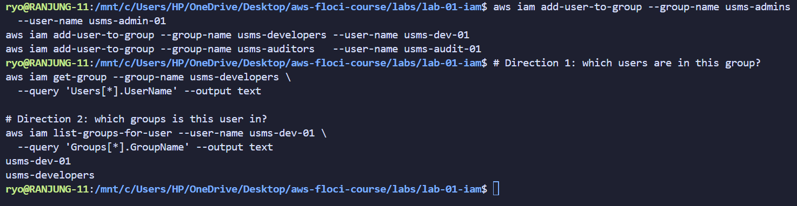

Then verified that the users are added to the groups.

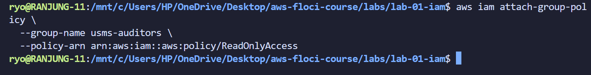

**Explore and attach an AWS managed policy**

These are the available AWS managed policies in the Floci environment.

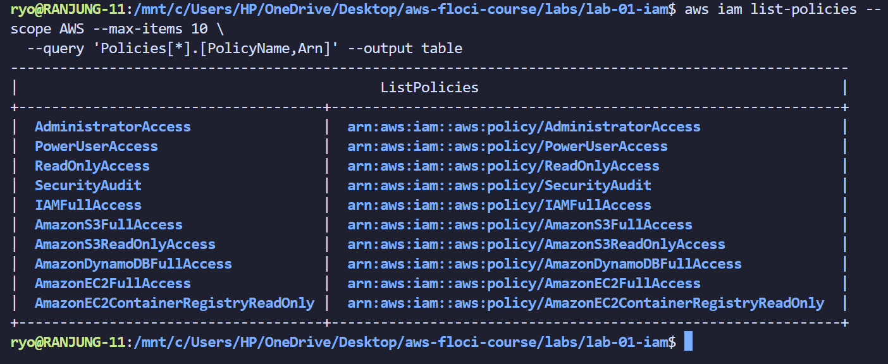

There are 10 policies available in the Floci environment.

Attached the AWS managed ReadOnlyAccess policy to usms-auditors, giving the group read-only access to AWS resources.

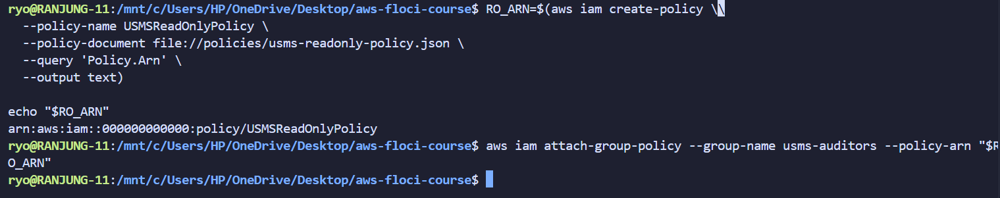

Then verified that the policy is attached to the group usms-auditors.

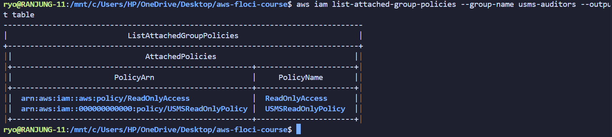

**Customer managed policy**

First, I created a policy file named USMSDeveloperBase.json and verified its content using python.

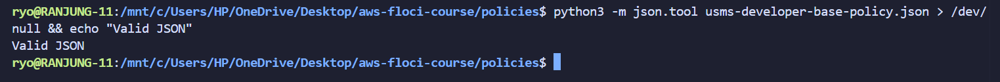

Created USMSDeveloperBase with aws iam create-policy, then attached it to usms-developers.

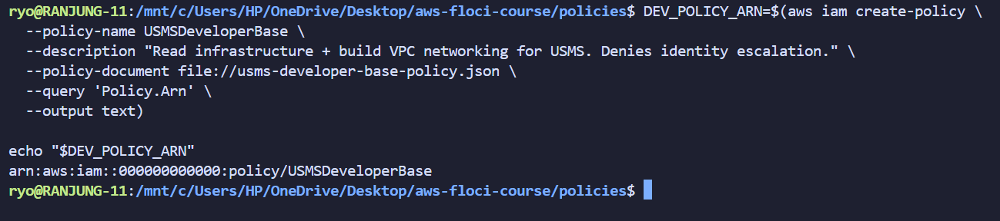

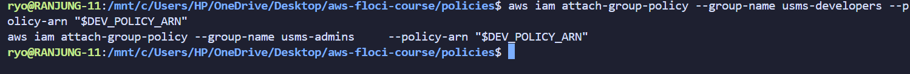

Verified that the policy is attached to the group usms-developers.

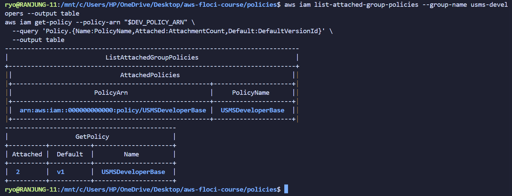

**S3 policy**
Made the USMSStudentDataReadWrite policy for S3 access. Separate buckets and object ARNs were used because they are different to specify bucket-level and object-level operations.

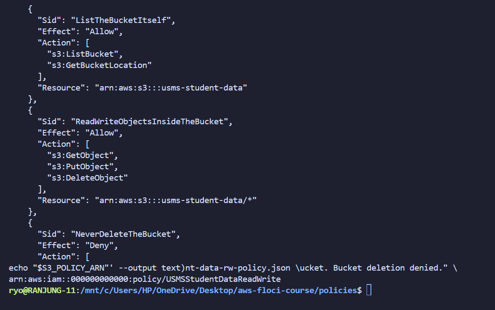

Then verified it.

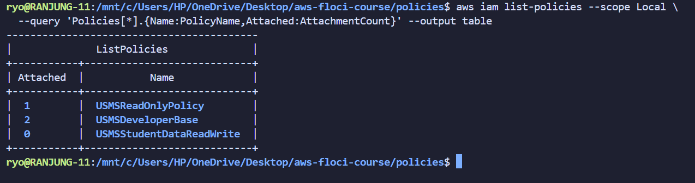

**Inline policy** 
We added the USMSSelfManageCredentials inline policy directly to usms-dev-01. This was done on purpose, and is a clear exception from permissions being assigned via groups.

**Inspect policies**
Examined permissions assigned to users and groups using list-attached-user-policies,list-attached-group-policies and list-user-policies.

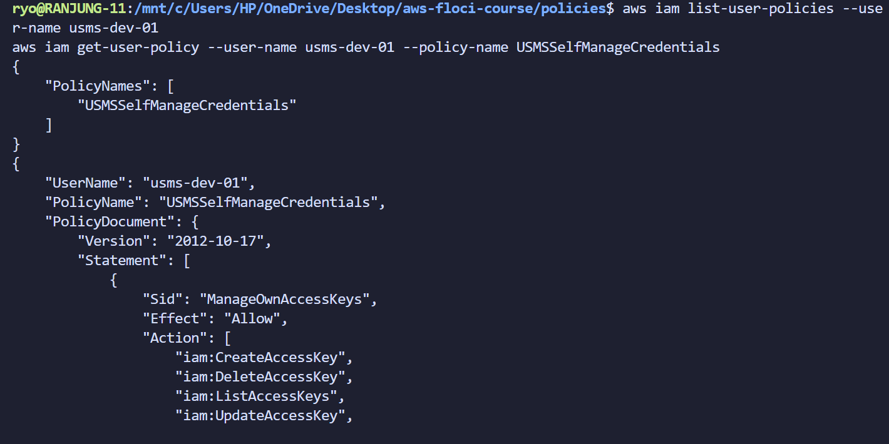

**Policy versions**
Listed the various versions of a customer managed policy with the AWS IAM service list-policy-versions.

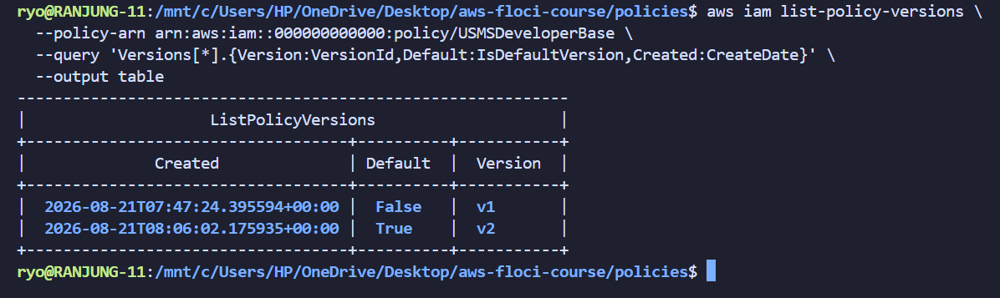

**EC2 role**
Created usms-ec2-app-role using trust-ec2.json. The trust policy enables the EC2 service to assume the role. Used the get-role command to verify the role.

**Lambda role**
Created usms-lambda-exec-role based on the trust-lambda.json file, which enables Lambda to assume the role.

**Access key**

Then generated an access key for the usms-dev-01 user. The access key was stored in the outputs/ directory, which is included in .gitignore to prevent it from being committed to Git.

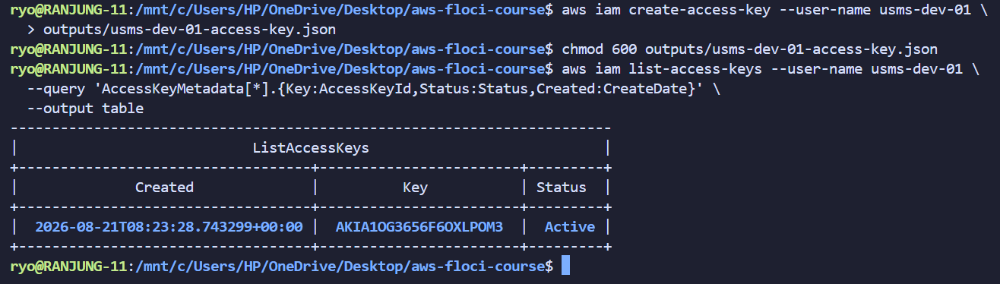

Using a IAM policy simulator, I tested the permissions of the usms-dev-01 user.

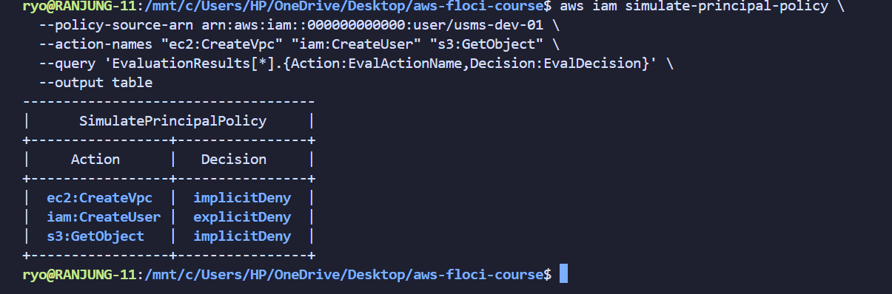

**Verification**

Finally,I made a verify-lab-01.sh script to verify the lab setup and configuration.

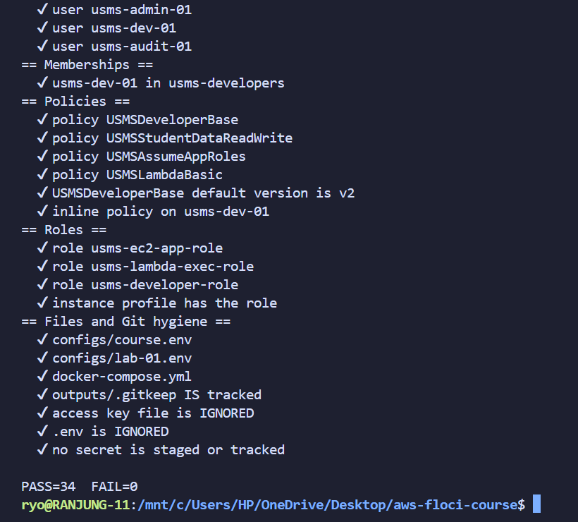

## Your turn tasks

**Creating User and Tagging**

Created a fourth user named usms-intern-01, tagged with Key=Role,Value=Intern, capturing its ARN into a variable named INTERN_ARN.

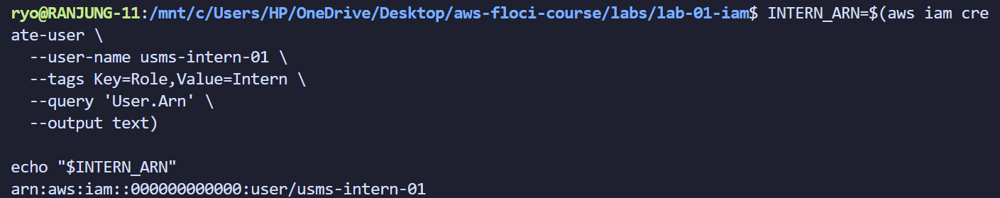

Verified that the user was created and tagged correctly.

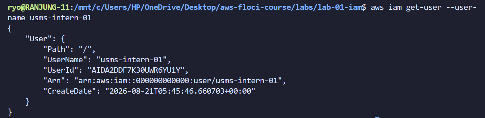

**Add users to groups**

Added the usms-intern-01 user to the usms-auditors group.

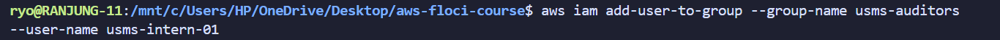

Verified that the user was added to the group.

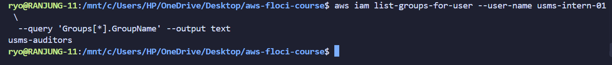

Generated a skeleton for aws iam create-policy and for aws ec2 create-vpc and saved both in templates/ folder.

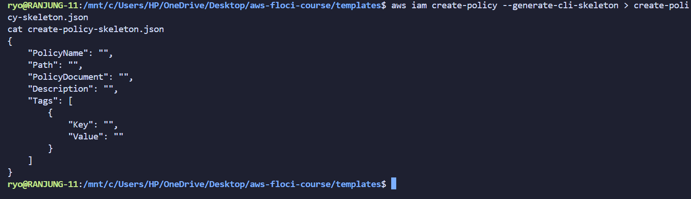
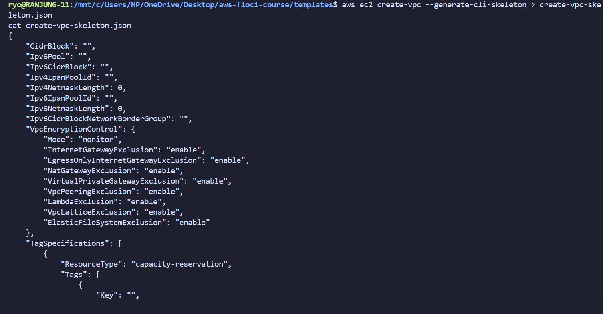

Verified it and found three templates in the templates/ folder.

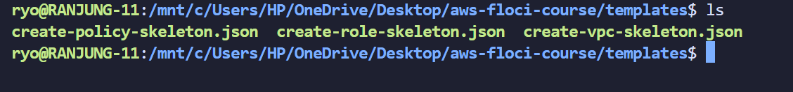

## Analysis and Discussion

This practical lab achieved on IAM (Identity and Access Management) using AWS CLI on floci. It demonstrated the creation and management of IAM users, groups, roles, and policies. The lab also verified the access permissions of the created IAM users and groups. 

The most important part was defining the storage mode, it ensures that the data is persistent and not lost even when the container is restarted. The floci storage mode is made to hybrid storage, which means that the data is stored both in the container and on the host machine. 

Another observation I made was seperating the policies from trust policies. This is important because it allows for better management and organization of permissions and access control.

## Reflection

So by doing this practical lab, I learned the importance of IAM in managing the AWS resources and how they are created. AWS follows the principle of least privelege and this lab taught me how to implement this principle by creating groups and assigning permissions based on roles.

I have done this lab twice, first time I did only some time and continued doing the next day, but then the data was lost because I did not set the storage mode properly. So I had to start over again and this time I made sure to set the storage mode to hybrid storage, which allowed me to persist the data even after restarting the container.

## Conclusion

The goals of this practical were achieved, the IAM users, groups, roles, and policies were created, configured, and tested with the AWS CLI with a local AWS emulator. Completing this lab, I understood the difference between permissions and trust policies, The three ways in which a policy can be attached, Anatomy of an ARN, How AWS evaluates allow and deny rules. 

Achieved skills include writing IAM policy documents in JSON, creating and managing identities with the AWS CLI, and engaging in good security practices like not putting secrets in version control. IAM is an essential AWS service as it provides access control for each and every service in the cloud with which it interacts, setting the groundwork for any secure cloud environment.