## Independent Lab Exercises

### Exercise 1: The QA identity

**Implementation and evidence:**

Created the IAM group `usms-qa` and the user `usms-qa-01` tagged with Role=QA and Project=USMS

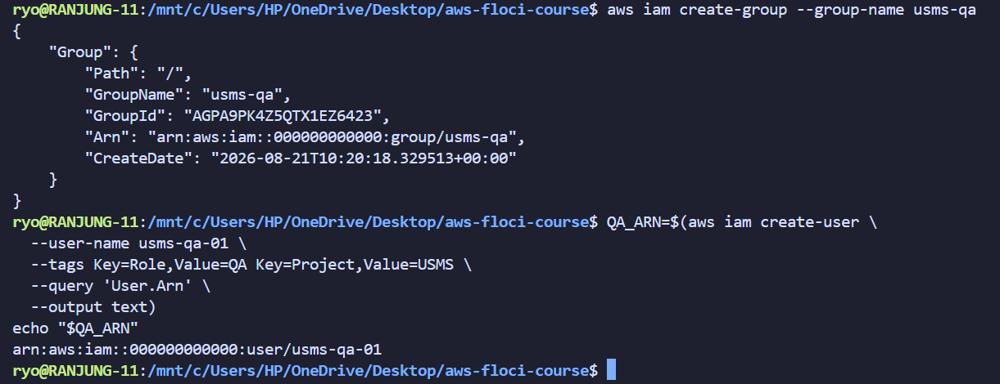

Then added the user `usms-qa-01` to the group `usms-qa`, and attached the `USMSDeveloperBase` policy to the group.

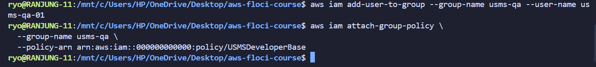

**Verification:**

Verified the user `usms-qa-01` is in the group `usms-qa`. 

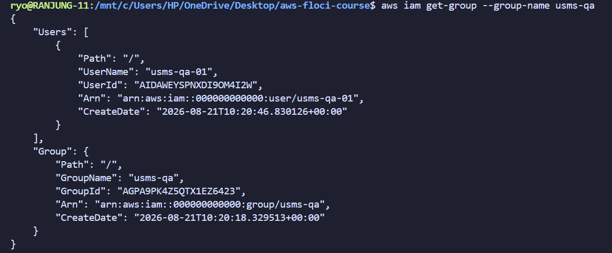

The user `usms-qa-01` has the permissions granted by the `USMSDeveloperBase` policy.

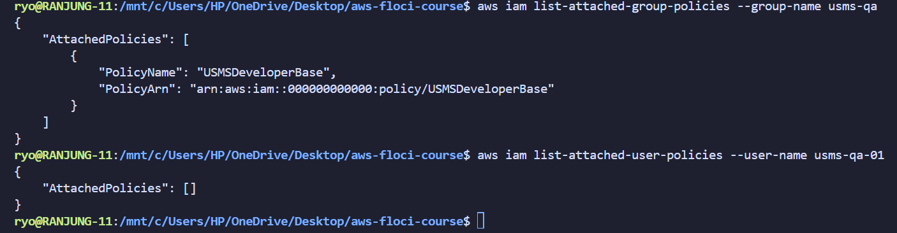

### Exercise 2: The read-only reporting policy

**Implementation and evidence:**

The USMS reporting service must read student transcripts but must never modify or delete them. Write a new customer managed policy called USMSReportingReadOnly that allows:

    listing the usms-student-data bucket,
    reading objects only under the prefix transcripts/,

and explicitly denies every s3:Put* and s3:Delete* action on that bucket.

Wrote policies/usms-reporting-readonly-policy.json allowing s3:ListBucket on the bucket and s3:GetObject only under transcripts/*, with an explicit Deny on all s3:Put* / s3:Delete* actions. Validated the JSON locally, then created it as policy USMSReportingReadOnly.

First, I wrote a policy file in policies/usms-reporting-readonly-policy.json directory and then validated the JSON using python.

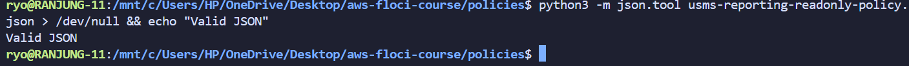

Created the policy USMSReportingReadOnly.

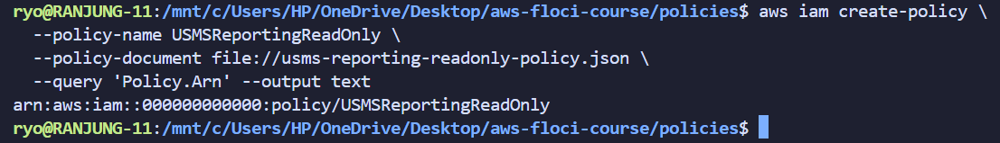

This policy allows the user to list the bucket and read objects under the prefix transcripts/, while denying any put or delete actions.

**Verification:**

Verified the policy using list-policies command and checked the policy document.

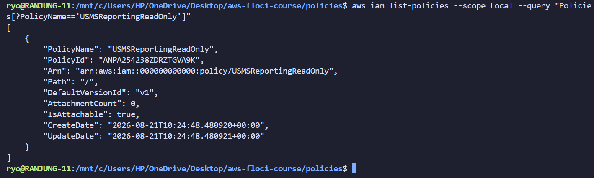

### Exercise 3: Problem solving: the third-party analytics role

**questioion**

The scenario, not the commands

A partner university runs an analytics service that must read USMS reports for at most 30 minutes at a time. They will not have an IAM user in your account; they will assume a role.

Requirements

Design and create a role usms-analytics-partner-role that:

    can be assumed by the identity arn:aws:iam::000000000000:user/usms-audit-01,
    cannot hold a session longer than 30 minutes,
    can read objects under arn:aws:s3:::usms-student-data/reports/* and nothing else,
    is tagged Key=Project,Value=USMS and Key=External,Value=true.

Then obtain temporary credentials for it and record the Expiration timestamp you receive.

Constraints

    Both halves of the trust handshake must be in place (Step 30 explains what that means).
    The trust policy and the permissions policy must be separate files in policies/.

**Implementation and evidence:**

Created trust policy trusting only usms-audit-01, and a permissions policy allowing s3:GetObject only under usms-student-data/reports/*. Created role usms-analytics-partner-role tagged Project=USMS, External=true. Assumed the role as usms-audit-01 and requested a 1800-second (30 min) session.

Created the trust policy in trust-analytics-partner-role.json only on usms-audit-01. Then created the role usms-analytics-partner-role with the trust policy and attached the permissions policy to it.

Validated the policy and role creation.

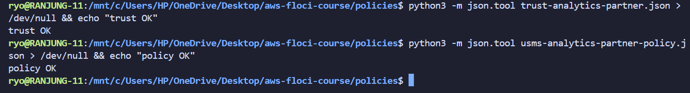

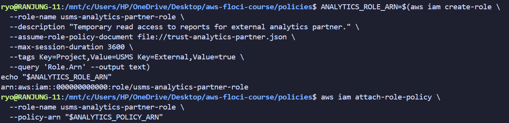

This result shows that the policies is attached to the role and the trust policy is in place.

**Verification:**

Verified the roles using the get-role command and checked the trust policy and permissions policy.

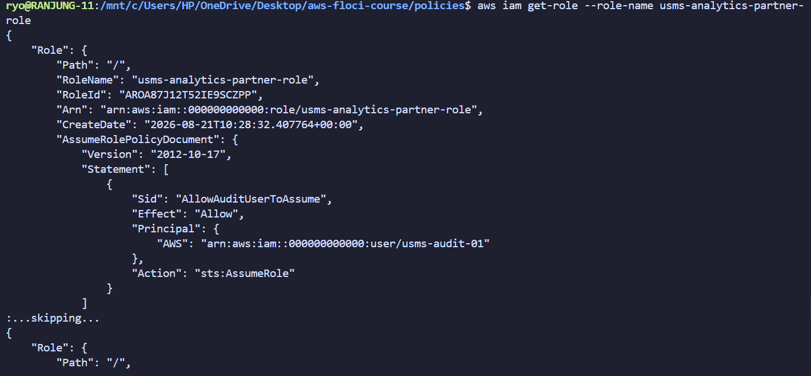

### Exercise 4: Backup operator policy

**Implementation and evidence:**

Here I have designed a least-privilege policy for a backup operator that allows them to list and read objects in the usms-student-data bucket, but not delete or modify them.

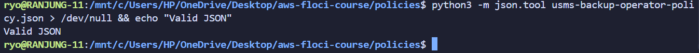

It is a valid json.

Created the policy USMSBackupOperator. 

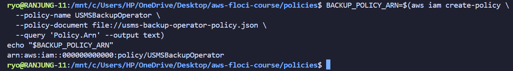

### Exercise 5: Prepare the identity for Lab 2

**Implementation and evidence:**

Verified that user usms-dev-01 currently has every permission.

Checked the current permission.

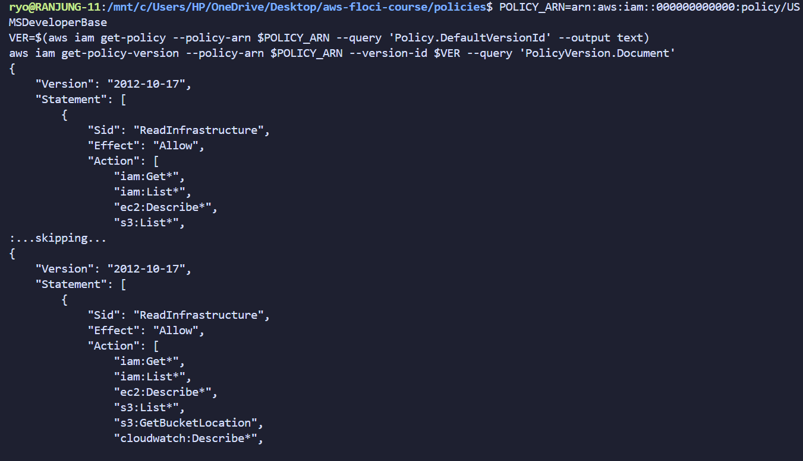

Initially the default version of the USMSDeveloperBase policy is v2.

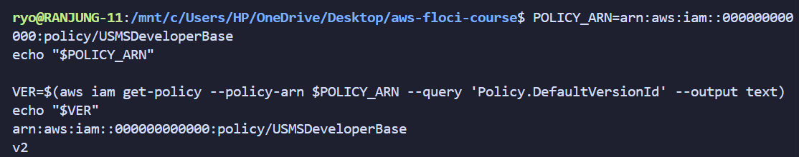

I need to make this to v3. I have created a new version of the policy USMSDeveloperBase with only the permissions needed for Lab 2, and set it as the default version.

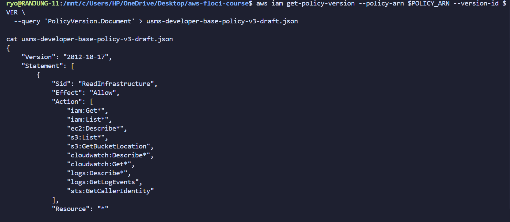

Now the default version of the USMSDeveloperBase policy is v3.

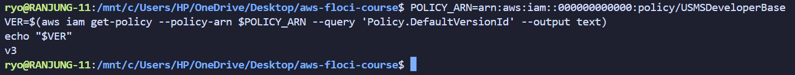