## Lab 2: Build Your VPC and Launch a Web Server

### Aim / Objective

This lab aims to create a Amazon VPC with publica nad pricvate subnet across two availability zones, configure a security group and launch an EC2 instance running a web server inside the VPC.

### Introduction

Virtula Private Network (VPC) is a private and secure network in AWS where the user can create and manage their own resources. It allows user to define their own IP address range, create subnets, configure route tables, and set up network gateways. VPC provides a secure and isolated environment for running applications and services in the cloud.

### Use Case

Some common use cases for VPC include:

- Hosting a scalable, publicly accessible web application (Amazon EC2) inside a network boundary.

- Securing sensitive data and applications by isolating them in private subnets.

- Controlling inbound/outbound traffic to instances using security groups, acting as a virtual firewall.

### System Architecture / Design

This lab builds a VPC with two Availability zones, each zone has one public and private subnet. The public subnet routes the internet traffic to the Internet Gateway, while the private subnet routes the traffic to the NAT Gateway. The EC2 instance is launched in the public subnet and is accessible from the internet.

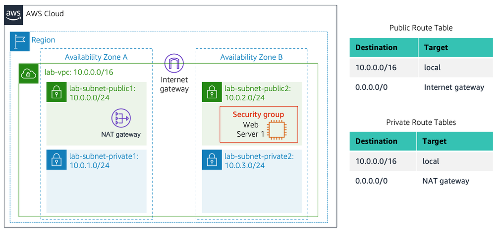

### Implementation Procedure

**Step 1: Create a VPC**

**Step 2: Added subnets in a second Availability Zone**
 
Created two additional subnets in a second Availability Zone, one public and one private. Then the subnets were associated with existing public and private route tables.

**Step 3: Create a VPC Security Group**

After that, created a Web Security Group in lab-vpc with an inbound rule allowing HTTP traffic from anywhere (0.0.0.0/0).

**Step 4: Launch a Web Server Instance**

Finally, launched an EC2 instance in the public subnet of lab-vpc and associated it with the Web Security Group. The instance was configured to run a web server and display the metadata of the instance when accessed via its public IPv4 DNS.

### Results and Evidence

**VPC Console Verification**

Shows the VPC is created with two public and two private subnets across two availability zones. The route tables are associated with the subnets and the Internet Gateway is attached to the VPC.

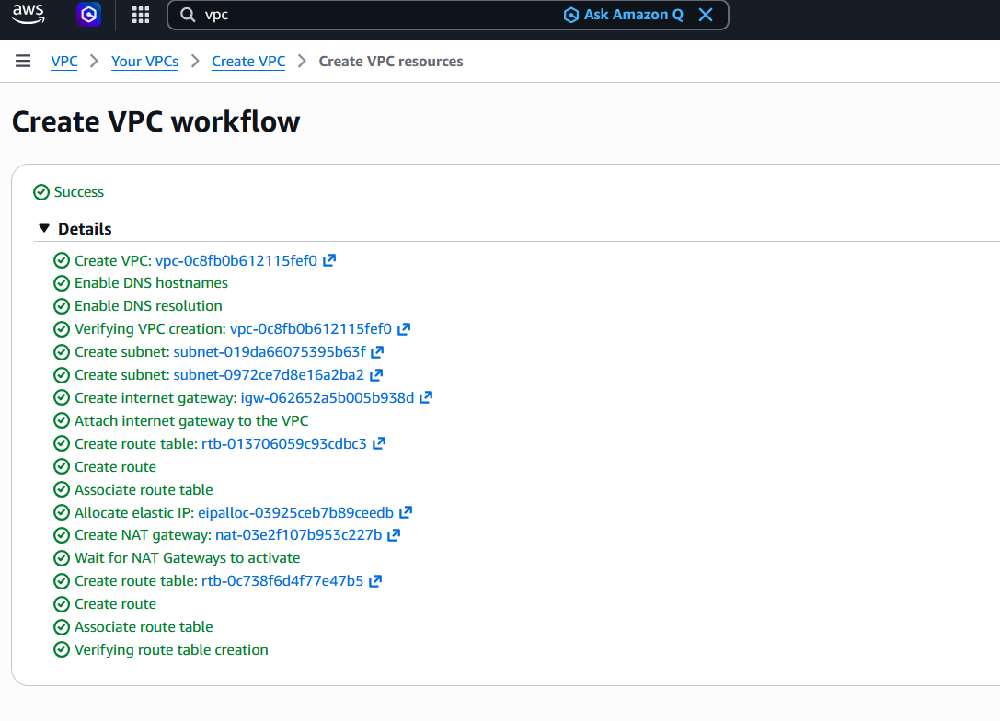

**Create Additional Subnets**

The second public subnet was created.

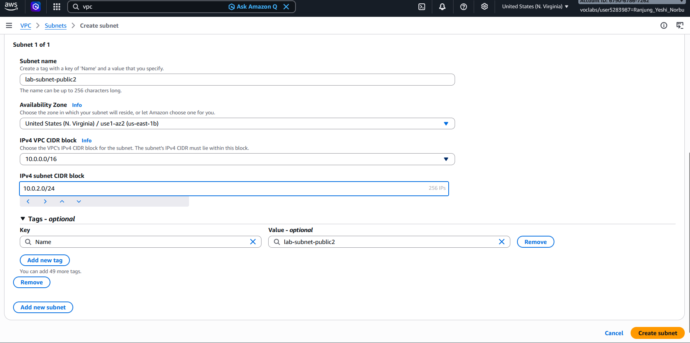

The second private subnet was created. 

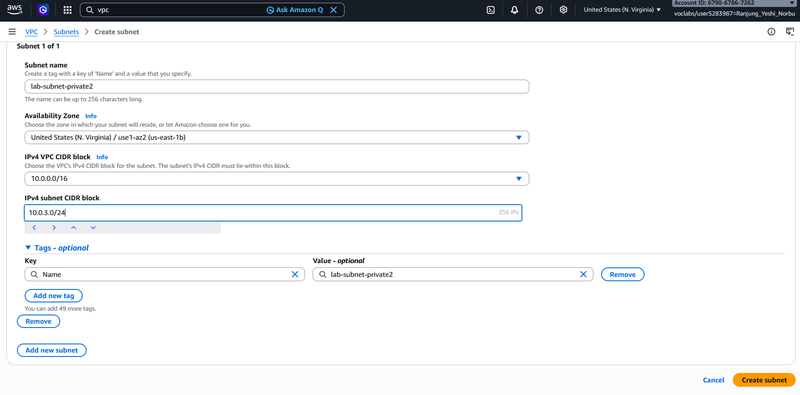

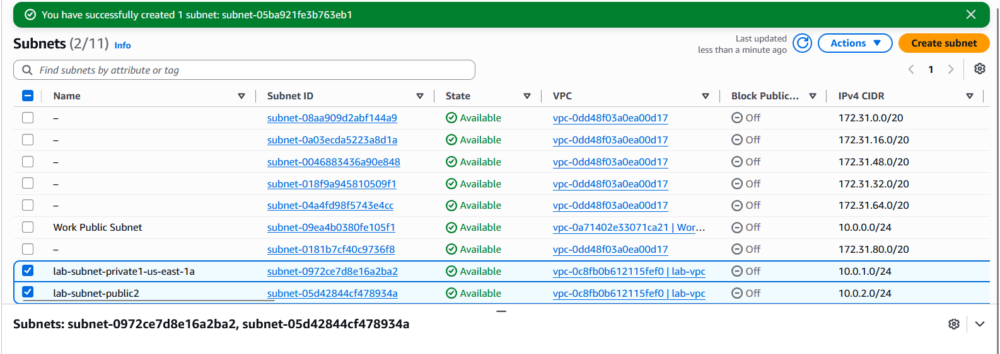

**Create a VPC Security Group**

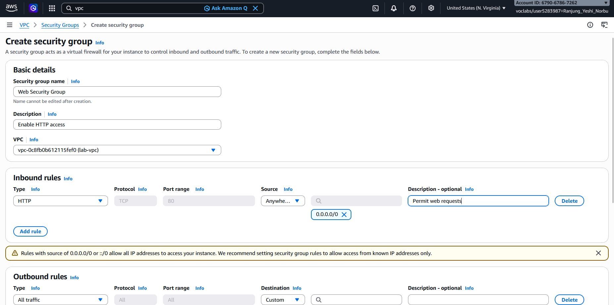

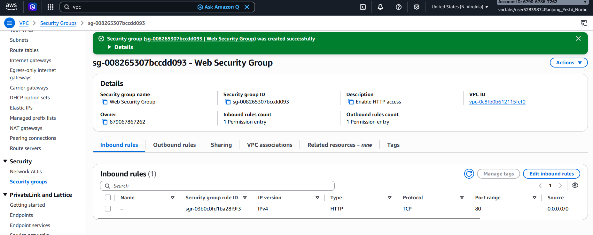

**Launch a Web Server Instance**

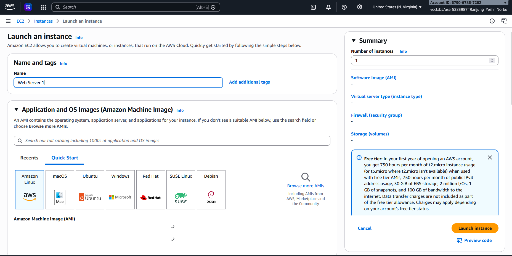

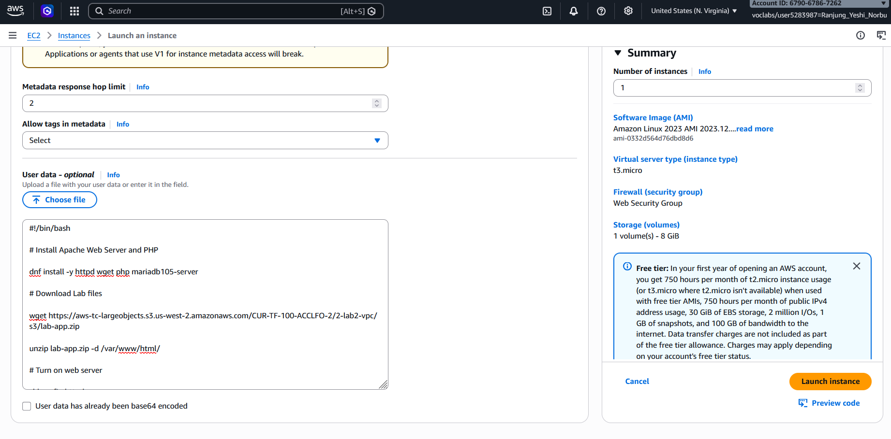

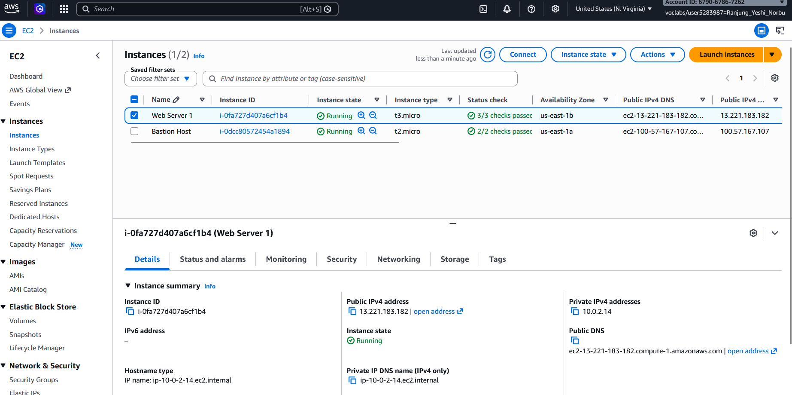

**Web Server Verification**

Shows the web server showing the metadata of the instance accessed via the public IPv4 DNS of the instance.

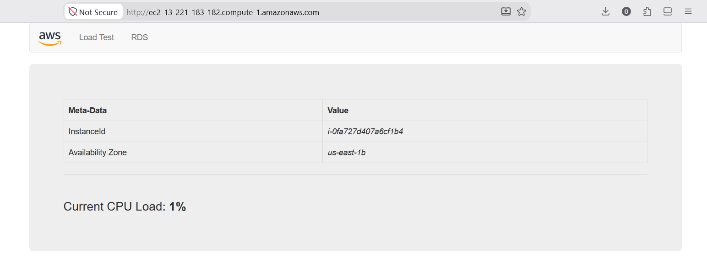

### Analysis and Discussion

This lab successfully created a VPC with public and private subnet across two availability zones. The EC2 instance passed all the test and was able to display the metadata of the instance when accessed via its public IPv4 DNS. This conforms that the security group, subnet routing, and Internet Gateway are configured correctly and the instance is able to communicate with the internet. 

I came to know that it is important to launch the EC2 instance in the public subnet and enable the public IP address so that the web server could be accessed from the internet. The public subnet route table has a 0.0.0.0/0 route to an Internet Gateway, this allows the instance to communicate with the internet.

### Reflection

This lab helped me understand how VPC works in practice. I learned that the subnet is considerd public and private based on the route table. I also learned that the NAT Gateway allows resources in the private subnet to access the internet without exposing them to the public. I also learned that security groups act as a firewall and controls the traffic to and from the instance. 

The main challenge I faces was keeping track of which subnet and route table belonged to each availability zone. In the future, I would like to learn about the VPC peering and endpoints in practical, I just know the theory about them.

### Conclusion

The lab was successful in creating a VPC with public and private subnets across two availability zones. Through this lab, how to create a VPC, subnets, security groups, and launch an EC2 instance running a web server was learned. The lab also demonstrated the importance of configuring the route tables and security groups correctly to allow communication between the instance and the internet. Overall, this lab provided hands-on experience in building a secure and scalable network infrastructure in AWS. Overall, this lab provided practical experience in designing and deploying a secure and reliable network on AWS.