## Lab 02: Virtual Private Cloud and Networking

### AIM / OBJECTIVE

The aim of this lab is to build a VPC using AWS CLI, with public and private subnets, an internet gateway, a NAT gateway and security groups.
### Introduction

A Virtual Private Cloud (VPC) is a virtual network inside the AWS where we can control the IP addresses, subnets, and traffic rules. It's main purpose is to provide a secure and isolated environment for running applications and services in the cloud. 

VPC is important because almost all AWS services like EC2 and RDS, depends on it to stay secure and connected properly. It is commonly used to separate a public web server from a private database and to control how traffic flows within a system.

### Use Case

In this practical, VPC is used to build the network foundation for the USMS application. Some common use cases for VPC include:

- Creating a public subnet so that it can be reached by students and staff from the internet.
- Creating a private subnet so that it can be used to store sensitive data and applications that should not be accessible from the internet.
- Using the NAT gateway to allow instances in the private subnet to access the internet for updates and patches, while still keeping them isolated from direct internet access.
- Using security groups to control inbound and outbound traffic to instances, acting as a virtual firewall.

### System Architecture / Design

The VPC is designed with two Availability Zones, with a public subnet holding the NAT gateway and application security group, and a private subnet holding the database security group and network ACL. Route  table on the right control traffic flow, with the public subnet routing to the internet gateway and the private subnet routing to the NAT gateway and the S3 endpoint.

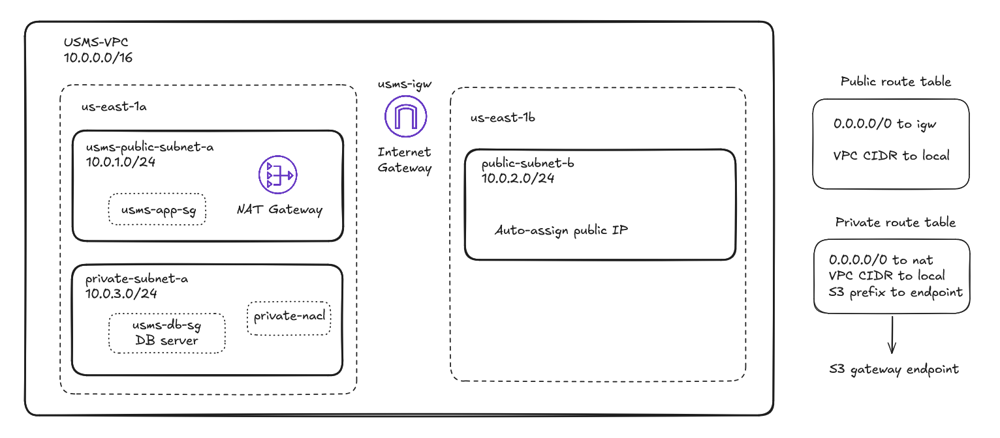

### Implementation Procedure

I started by resuming the environment from Lab 1. I assumed the developer role and created a VPC with the address range 10.0.0.0/16. 

Then created an internet gateway and attached it to the VPC. After that created a public subnet and a private subnet in the same Availability Zone. Then created a public route table with a route to the internet gateway and connected it to the public subnet, and a separate private route table with no internet route, connected to the private subnet. I checked both subnet route tables to confirm the public one had internet access and the private one did not.

After that, created a security group for the application tier allowing HTTP, HTTPS, and SSH only from inside the VPC, and a second security group for the database tier allowing access only from the application security group. Then created a network ACL for the private subnet allowing only the necessary traffic, and associated it with the private subnet. 

To let the private subnet reach the internet for updates without accepting any incoming connections, I created a NAT gateway with an Elastic IP in the public subnet and pointed the private route table to it. I also created an S3 gateway endpoint so traffic to S3 stays inside the AWS network instead of going through the internet.

Finally, I verified that all resources were created correctly and that the network configuration persisted across container restarts.

### Evidence and Results

**Step 1: Resume the environment**

Resumed the environment from Lab 1 and verified that the developer role and user were present.

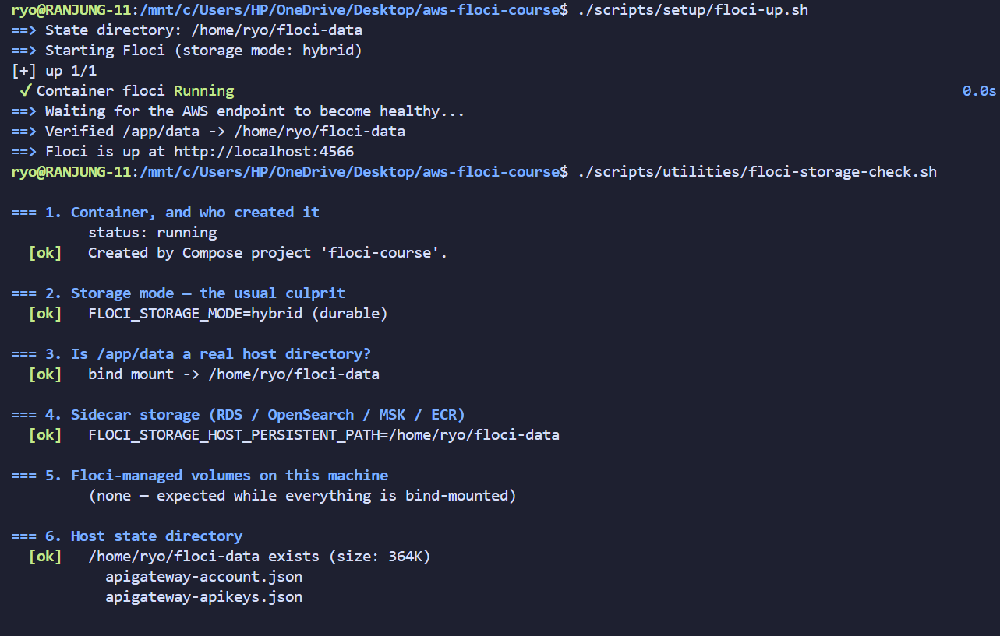

**Verify**

To verify that the container is persitent, I removed the container and then ran floci-up.sh again. The container was recreated and the data persisted.

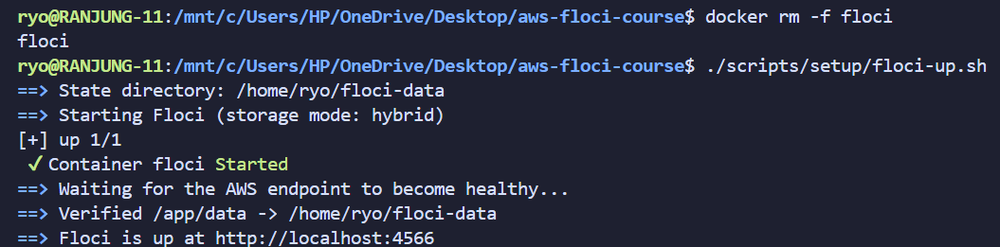

**Step 2: Load the previous lab's environment and confirm your identity**

This lab needs three things Lab 1 produced: the developer role's name, the developer user's name, and your account ID.

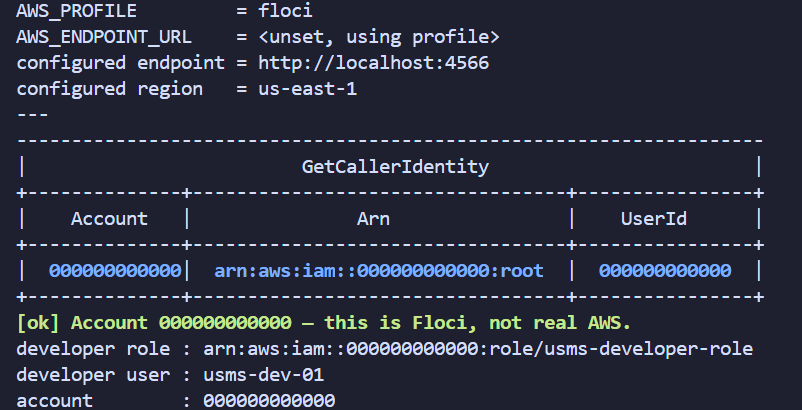

**Step 3: Assume the developer role and create the VPC**

The usms-developer-role we created in Lab 1 and gave it USMSDeveloperBase. Here we assume that role and use it to create the VPC. This build action as the least privilege identity.

**Read the policy before you rely on it**

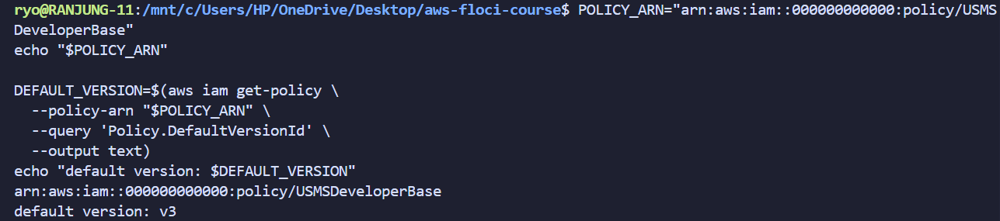

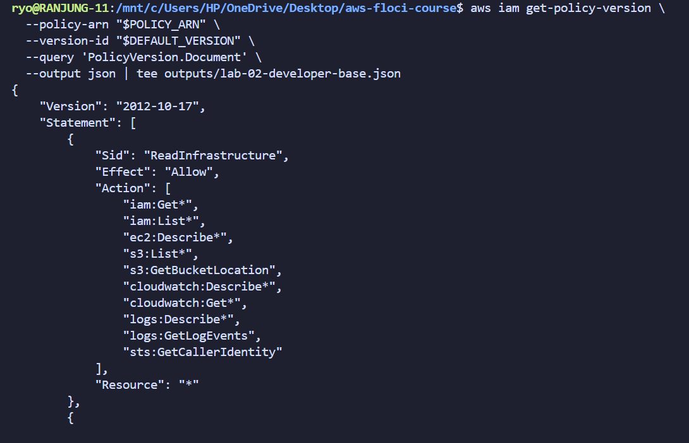

**Assume the role**

The assume-role call must be made as usms-dev-01, because that is the principal the role's trust policy names. Making the call as root would work in Floci (which does not enforce trust policies) and fail on real AWS so we do it correctly.

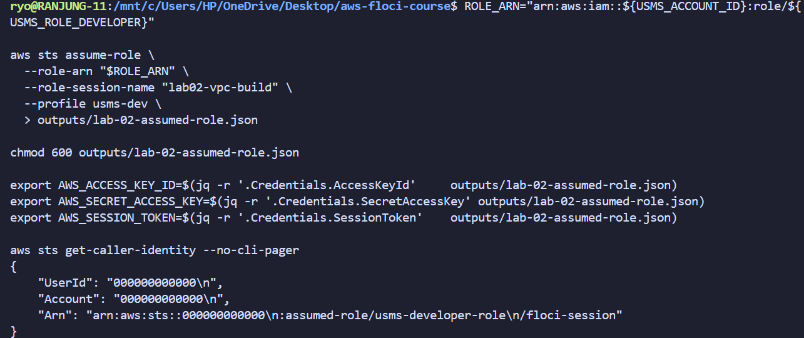

**Create the VPC**

Created the VPC with CIDR 10.0.0.0/16 and tagged it.

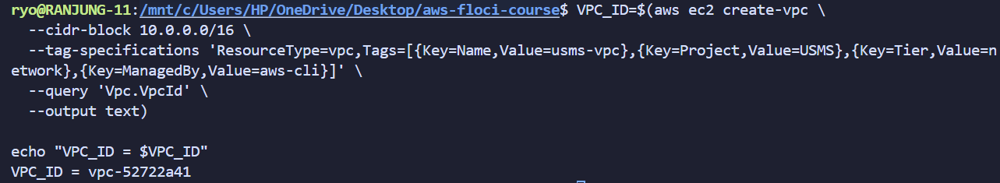

**Step 4 Restore your normal identity**

`usms-developer-role` was created with a one-hour maximum session duration. 

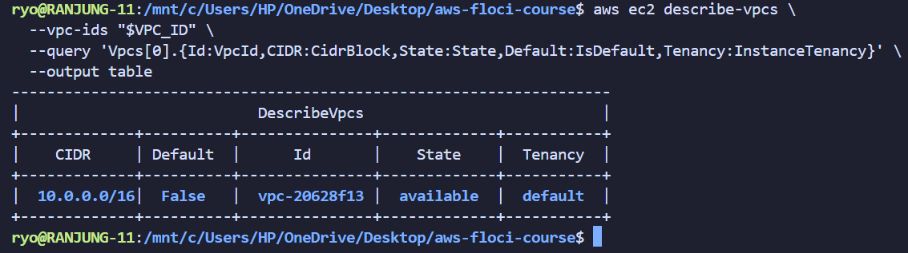

**Step 5: Enable DNS support and DNS hostnames**

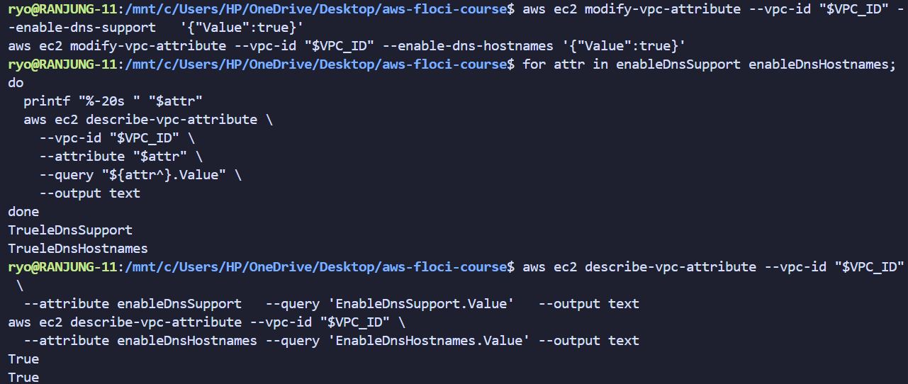

**Step 6: Create and attach the internet gateway**

Here an internet gateway is created. 

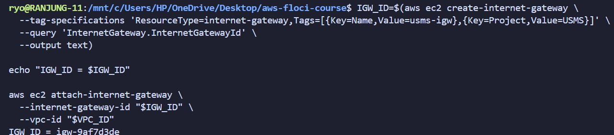

An internet gateway is created unattached and is a VPC-level object in its own right.

**Verify**

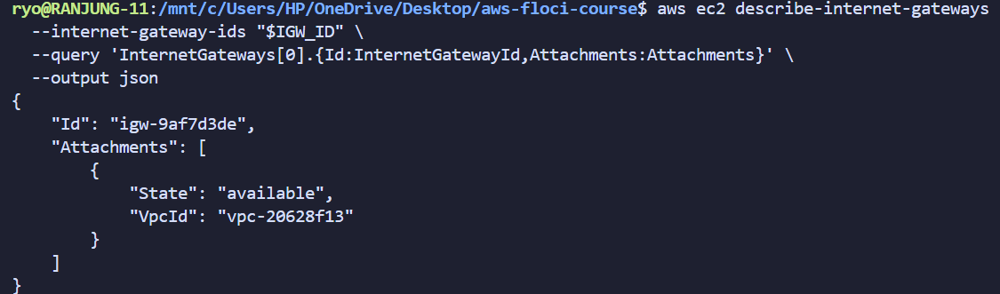

**Step 7: Create the public subnet in us-east-1a**

Here a public subnet is created with CIDR `10.0.1.0/24`.

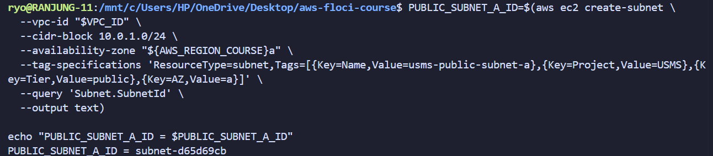

**Verify**

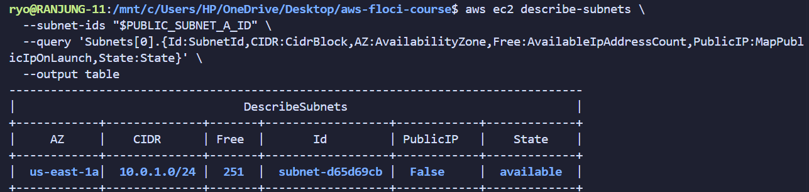

**Step 8: Turn on auto-assign public IPv4 for the public subnet**

By default, an instance launched into any subnet gets a private address and nothing else. 

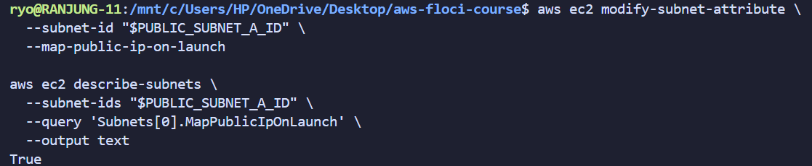

**Step 9: Create the private subnet in us-east-1a**

This is where the USMS data tier lives. Nothing in here will ever have a route to the internet gateway, which is the whole point the transcripts database must not be reachable from the internet.

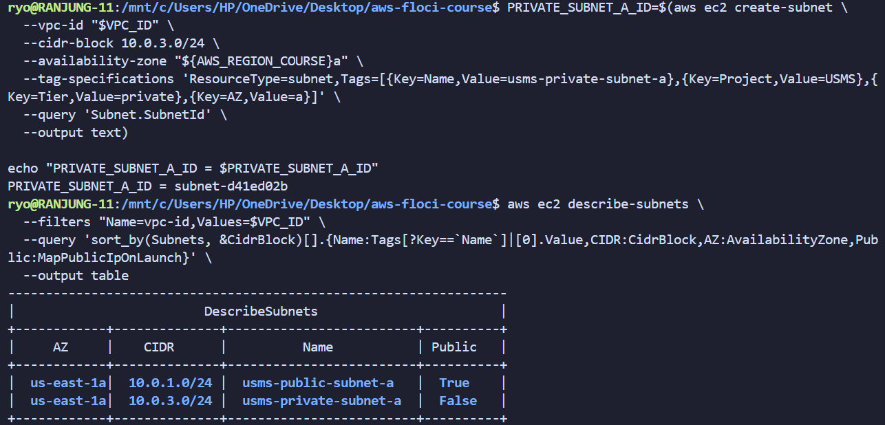

Created a private subnet and verified it.

**Step 10: Create the public route table and the default route**

 Every VPC has a main route table containing one entry 10.0.0.0/16 to local which is why instances in different subnets of the same VPC can already talk to each other.

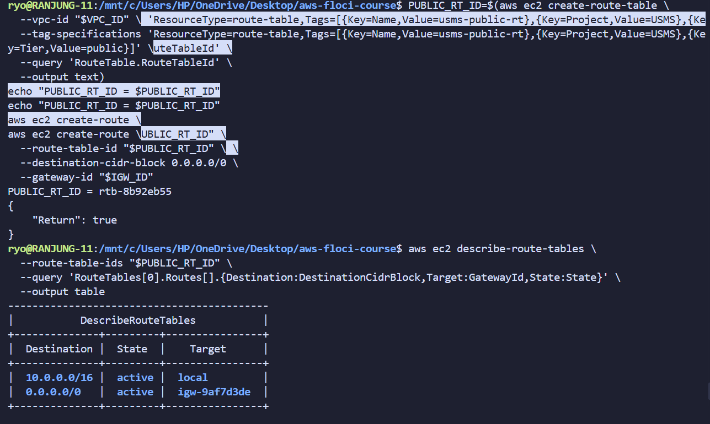

**Step 11: Associate the public subnet with the public route table**

A route table with no associations affects nothing. This is the step that actually connects the two.

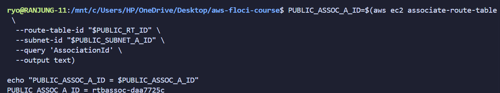

### Your Turn Task

So the task is to create a second public subnet. Create usms-public-subnet-b with CIDR 10.0.2.0/24 in us-east-1b, turn on auto-assign public IPv4 for it, associate it with usms-public-rt, and capture its ID into PUBLIC_SUBNET_B_ID. Tag it consistently with the others.

**Implementation and evidence:**

First, I have created a second public subnet with CIDR 10.0.2.0/24.

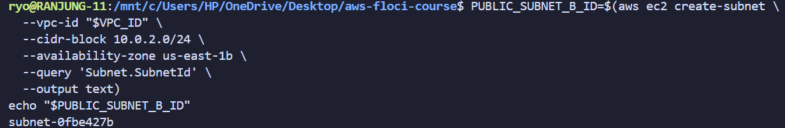

Then made any instance launched in this subnet automatically get a public IP, so it behaves as a true public subnet and also labeled the subnet with Name, Project, etc. so it's identifiable and consistent with the other resources.

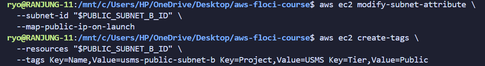

In this step the it finds usms-public-rt's ID, and links the new subnet to that route table so traffic from it follows the same public routing (through the internet gateway) as subnet A.

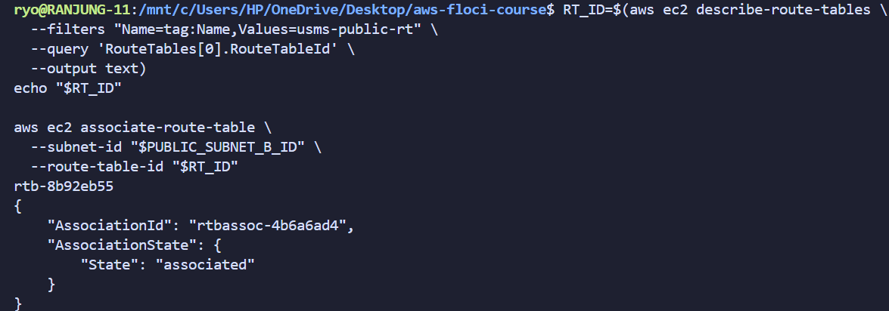

Confirms usms-public-rt now has two subnets attached to it (A and B).

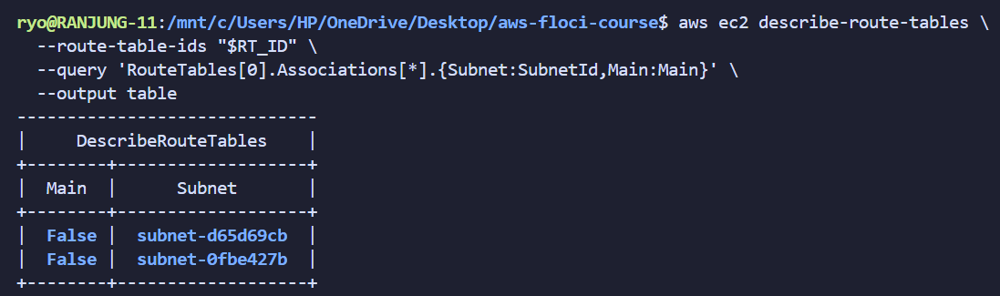

**Step 12: Create the private route table and associate the private subnet**

The private subnet must not inherit the main route table, because on a VPC we did not create the main route table might already have a default route in it. 

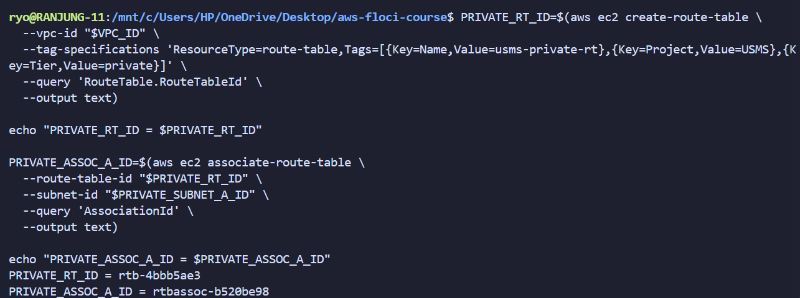

**Step 13: Prove the two subnets are actually different**

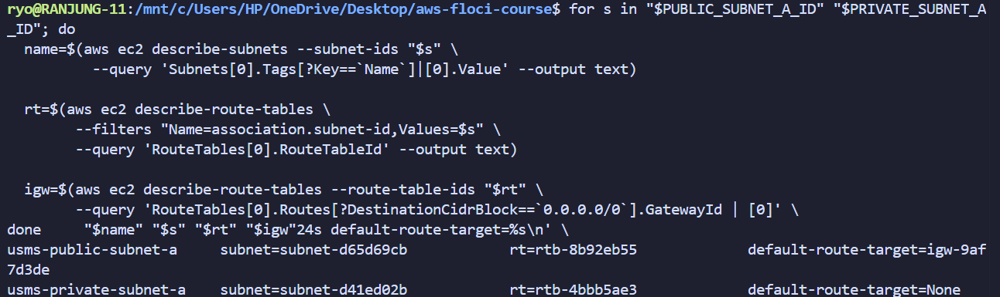

**Step 14: Create the application security group**

The usms-app-sg security group is created and attached to  USMS web server.

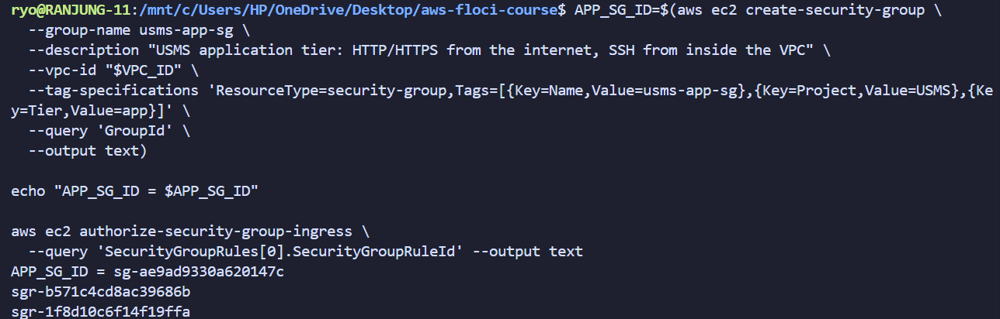

### Your Turn Task

In this task, need to add an inbound rule to usms-app-sg allowing TCP 443 from 0.0.0.0/0, and give the rule a description so that a future reader knows why it is there.

**Implementation and evidence:**

First, I have added a new inbound rule to usms-app-sg allowing TCP port 443 (HTTPS) from anywhere (0.0.0.0/0).

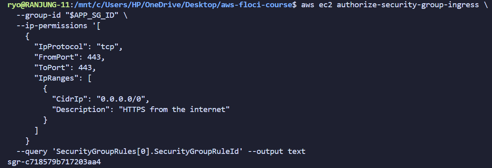

Then verified the rule was added and the description is present.

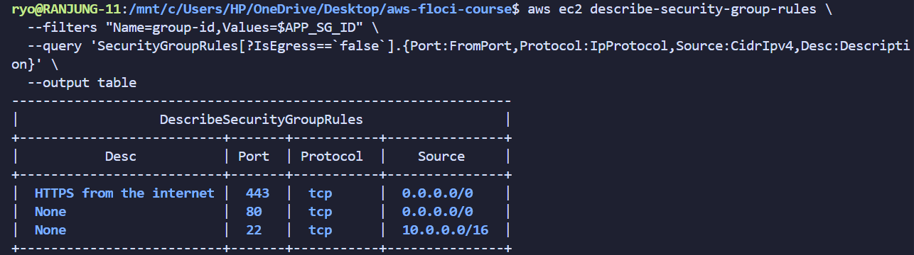

**Step 15: Create the database security group, sourced from the application group**

The data tier must accept PostgreSQL connections from the application tier and from nothing else. The way is to name the application's security group as the source, so the rule keeps meaning the right thing when the web tier is re-addressed, scaled, or moved to another subnet.

**Create the group**

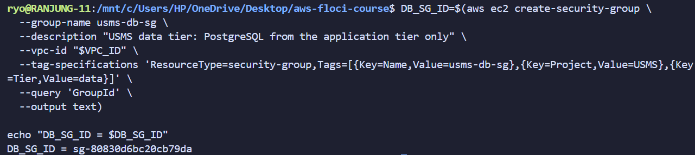

**Write the rule as a JSON document**

In the policies directory, created a JSON file named `usms-db-sg-ingress.json` containing the rule allowing TCP port 5432 from the application security group.

**Apply the rule**

I applied the rule and verified it was added to the security group.

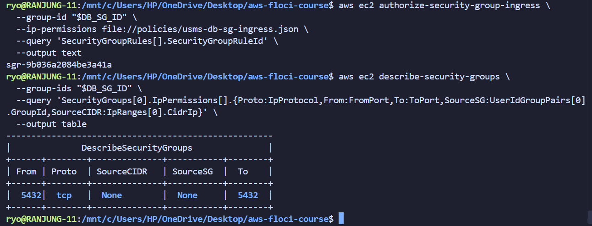

**Step 16: Read the groups back, and understand what stateful means**

Here I just looked at the rules set for both groups in one place, including the outbound rule nobody asked for, and reason about a request that has to traverse both.

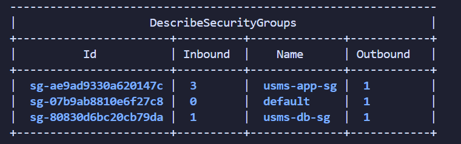

**Step 17: Explore the default network ACL, then create a private one**

The default network ACL allows all traffic in both directions. For a more secure setup, we will create a private NACL with restrictive rules.

**Create the private NACL**

Created a new network ACL and defined the inbound and outbound rules.

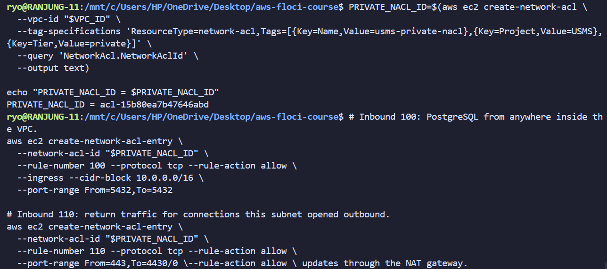

**Verify**

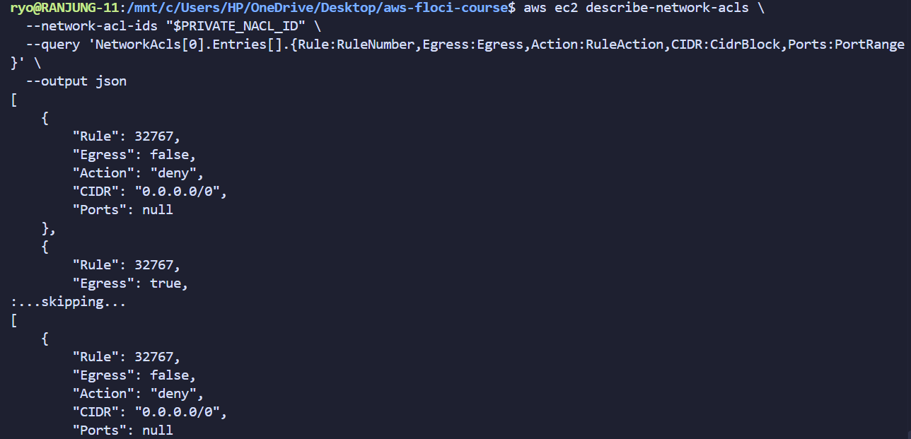

**Step 18: Associate the private NACL with the private subnet**

Replaced the private subnet's default network ACL association with the new private NACL (usms-private-nacl), since every subnet already has a NACL and the existing one must be swapped rather than added.

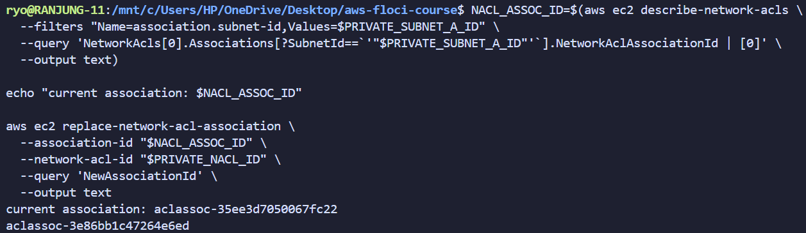

**Step 19 Give the private subnet outbound internet access with a NAT gateway**

Allocated an Elastic IP and created usms-nat in the public subnet, since a NAT gateway needs a public address and must sit in a subnet that already has internet access.

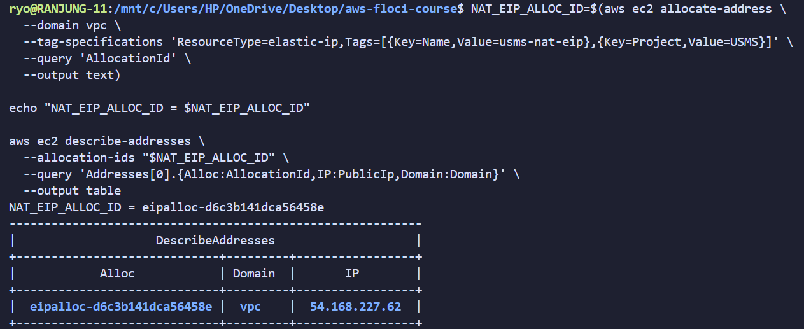

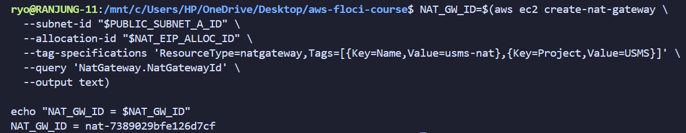

**Step 20 Point the private route table at the NAT gateway**

Added a default route (0.0.0.0/0) in usms-private-rt pointing to the NAT gateway instead of the internet gateway, giving the private subnet outbound-only internet access.

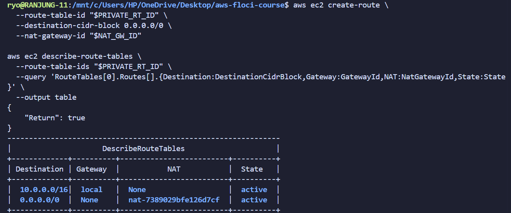

**Step 21 Create the S3 gateway endpoint**

Created usms-s3-endpoint and attached it to the private route table, so traffic to S3 stays inside the AWS network instead of routing out through the NAT gateway.

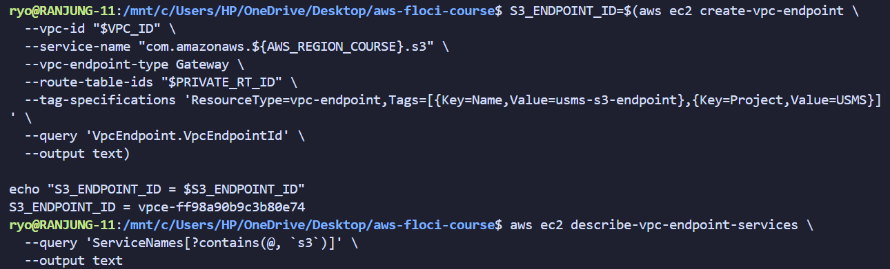

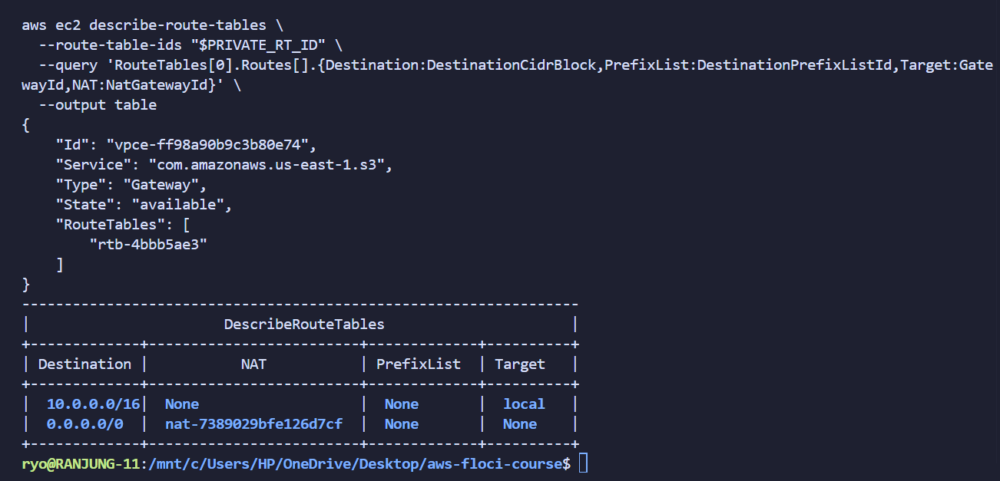

**Step 22 Audit your tags**

Ran describe-tags filtered by Project=USMS to confirm every resource created in this lab was correctly tagged.

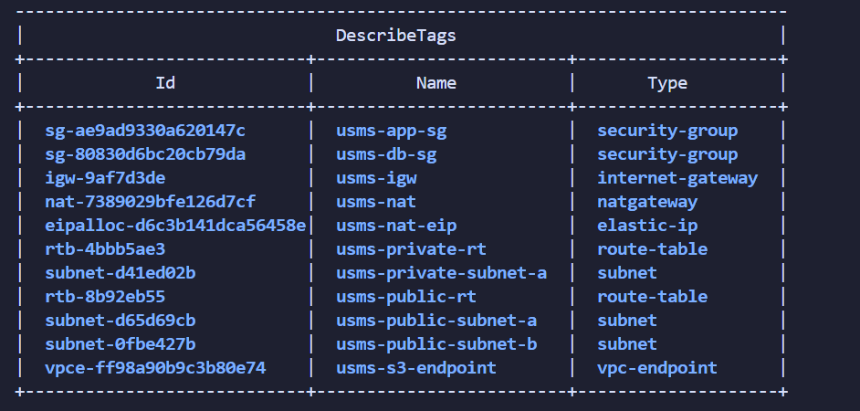

#### Your Turn Task

In this task, I need to produce a table of every subnet in usms-vpc showing its name, CIDR, Availability Zone and tier, with the private subnets listed first, using --filters to restrict the query to this VPC and --query to shape and sort the result. Save the output to outputs/lab-02-subnet-inventory.txt.

**Implementation and evidence:**

I queried all subnets in usms-vpc, extracted Name and Tier from tags, sorted private subnets before public ones.

Then I saved the output table to outputs/lab-02-subnet-inventory.txt.

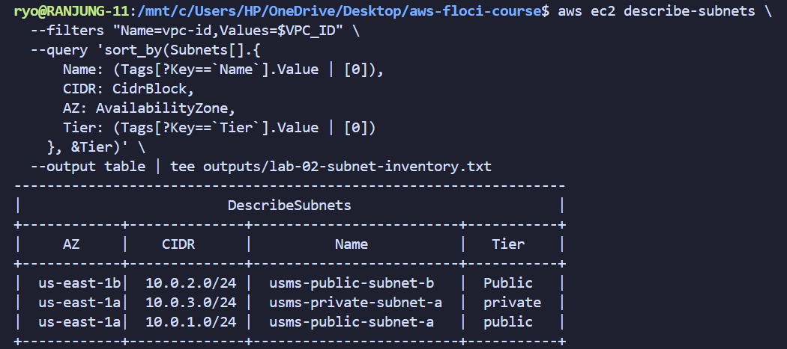

**Verification**

I verified the output file contains the expected information and is formatted correctly.

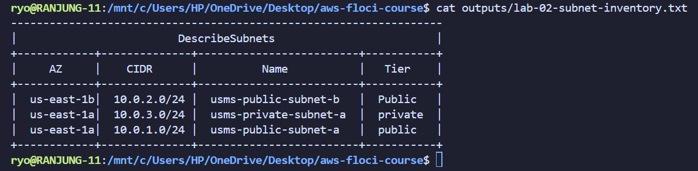

**Step 23: Prove the network survives a restart**

In this step, I stopped the floci container and then restarted it to prove that the network configuration is persistent across container restarts.

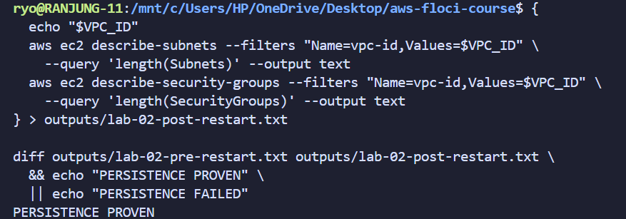

Here the results shows PERSISTENT PROVEN. This proves that the network configuration is persistent across container restarts, and the VPC and its associated resources remain intact.

**Step 24: Write configs/lab-02.env**

Every shell variable you have created dies when you close this terminal. This step is what turns four hours of work into something the next lab can consume without you remembering anything.

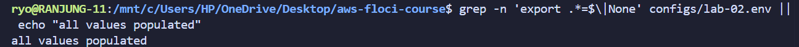

### Verification

Wrote an script to read the environment variables from configs/lab-02.env and verify that they are set correctly.

### Analysis and Discussion

This lab achieved the goal of creating a VPC with a public subnet and a private subnet, correct routing so only the public subnet can be reached from the internet, a NAT gateway giving the private subnet outbound-only access, two security groups controlling traffic between the web and database tiers, a network ACL as a second layer of protection on the private subnet, and an S3 endpoint so traffic to S3 does not need to leave the AWS network.

Most result matches the results that were expected. A few errors were encountered, after restarting floci, the VPC could not be found by its tag, even though it still existed. The actual cause was that the VPC's Name tag had never been applied correctly when it was created.

### Reflection

Before doing this practical, I already had a basic understanding of what a VPC is and how it works from the AWS Academy labs. However, I had not worked with AWS using the CLI. Through this practical, I learned how to create a VPC with public and private subnets, set up an Internet Gateway, and configure security group and network ACL rules in a more hands-on way. 

I also learned how to use the AWS CLI to create and manage resources, which is a valuable skill for automating tasks and managing infrastructure as code.

### Conclusion

The practical demonstrated how to create a VPC with public and private subnets, an internet gateway, a NAT gateway, security groups, and a network ACL. It also showed how to verify the configuration and ensure that it persists across container restarts. The lab provided hands-on experience with AWS networking concepts and reinforced the importance of proper tagging and resource management. It helped me to develop skills in writing AWS CLI commands with filters and queries and troubleshooting broken configuration files.