### Exercise 1: Third public subnet

In this exercise, I have created a third public subnet called `usms-public-subnet-c` in `us-east-1c` with CIDR `10.0.5.0/24`, tagged consistently with the existing subnets, auto-assigning public IPv4 addresses, and associated with `usms-public-rt`.

**Evidence:**

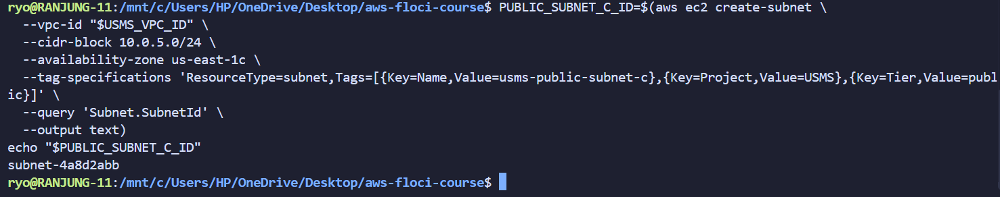

Created the third public subnet `usms-public-subnet-c`.

Then I have enabled auto-assign public IPv4 addresses for this subnet and associated it with the existing public route table `usms-public-rt`.

**verify**

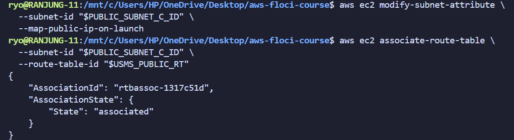

Verify the route table association and auto-assign public IPv4 addresses for the third public subnet `usms-public-subnet-c`.

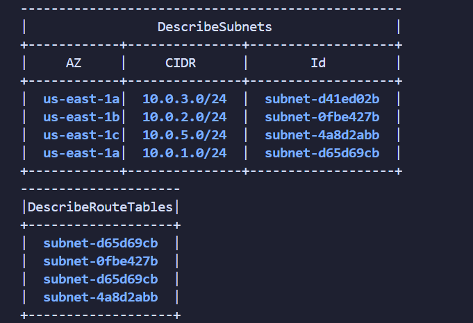

### Exercise 2: Bastion security group

In this exercise, I have created a security group called usms-bastion-sg in usms-vpc allowing SSH only from one address.

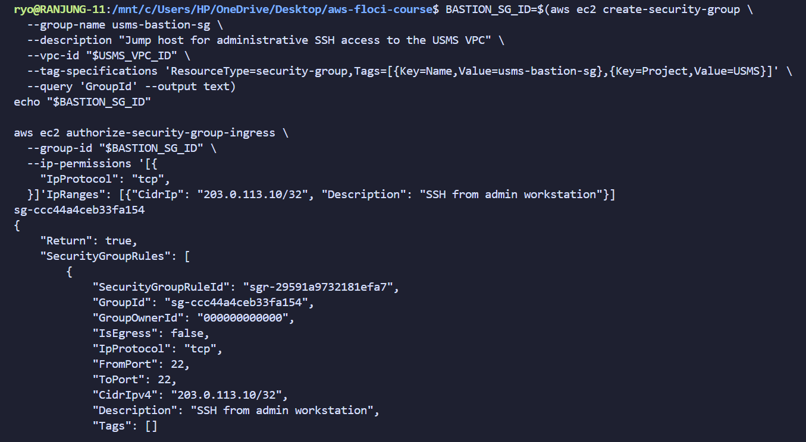

Then added the new group-referenced SSH rule to usms-app-sg and removed old CIDR-based SSH rule.

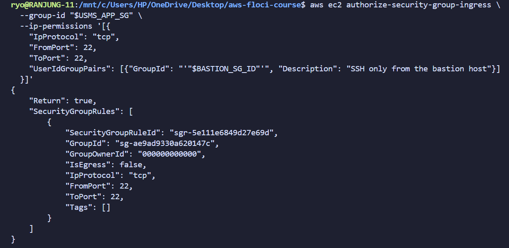

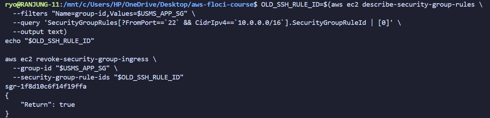

**Verify**

Verified the exactly one SSH rule, sourced from the bastion group.

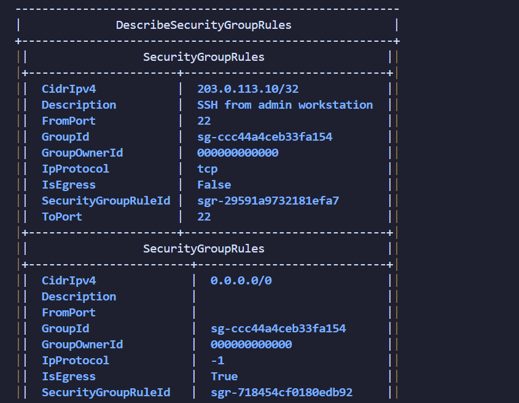

### Exercise 3 Problem solving: prove a claim about the network

In this exercise, I have written a script called `scripts/utilities/lab-02-network-report.sh` that proves the claim that the private subnet can reach the public subnet, but the public subnet cannot reach the private subnet.

Then I have tested from two different directories and the script produced the expected results.

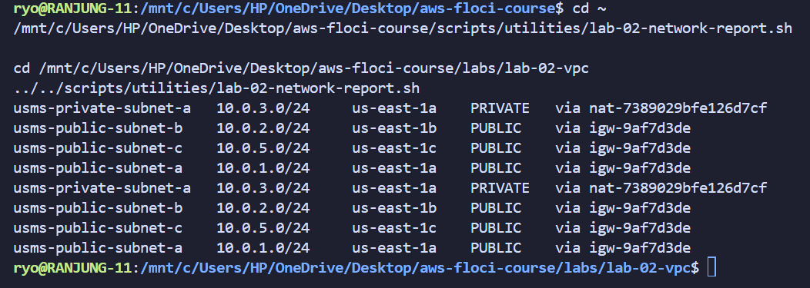

### Exercise 4 Challenge: design and defend

1. Subnet placement

So the exam result service goes in the usms-private-subnet-a and it reads the transcripts database, which already lives in the private subnet, so placing the service there keeps the data path entirely internal.

2. Security groups and exact rules

I have created a new security group called usms-exam-sg and added the following rules:

| Direction | Source/Destination | 
|---|---|
| Inbound | 10.10.0.0/16 | 
| Outbound | 0.0.0.0/0 (via NAT) | 

3. Network ACL

No change to the existing private NACL, which already allows all inbound TCP on port 5432 from 10.0.0.0/16 and the outbound rules.

**Implementation and evidence:**

I have created a new security group called usms-exam-sg and added the neccessary inbound and outbound rules.

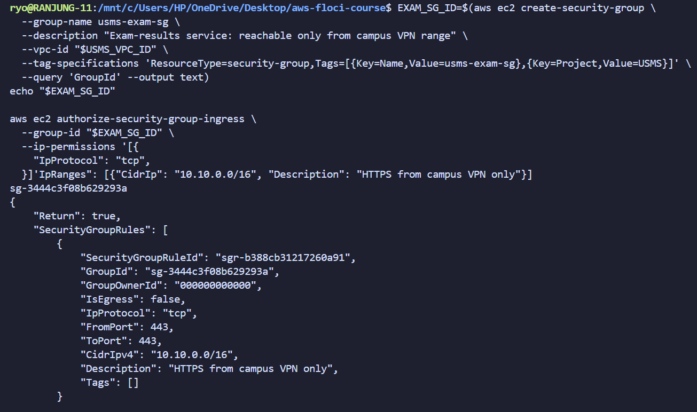

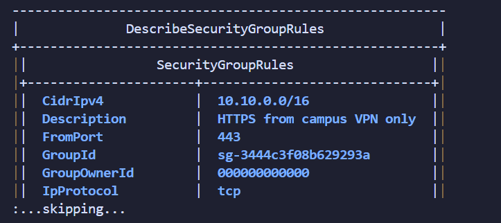

usms-exam-sg created successfully, with one inbound rule (TCP 443 from 10.10.0.0/16) confirmed by describe-security-group-rules

### Exercise 5 Integration: complete the second Availability Zone

**Implementation and evidence:**

First, I have proved my identity with the get-caller-identity command and then assumed the usms-developer-role to create the private subnet in us-east-1b with CIDR 10.0.4.0/24.

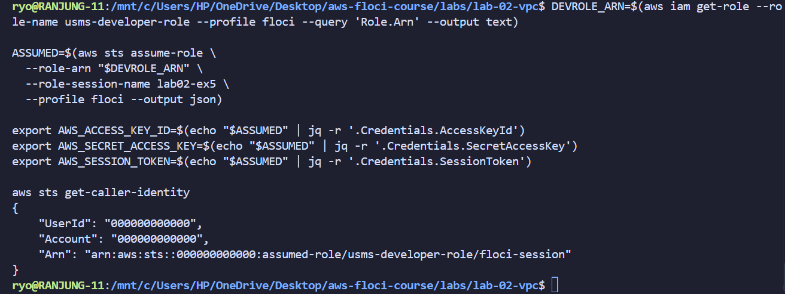

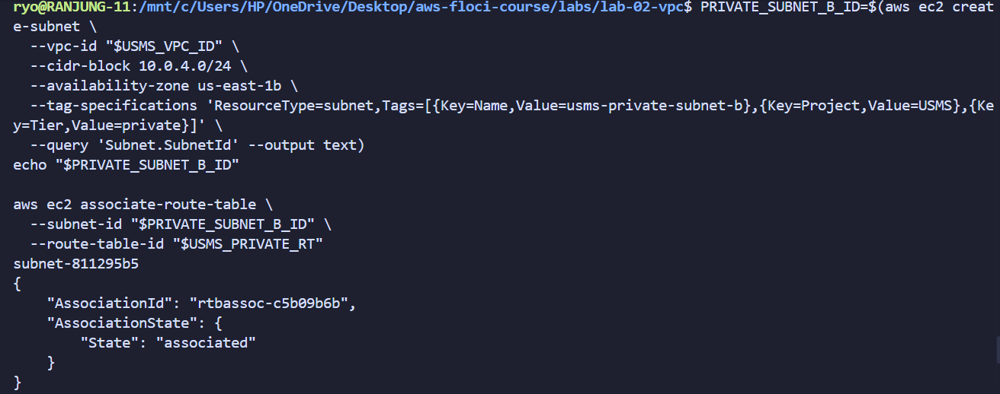

After creating the subnet, I have applied the private NACL to the new subnet.

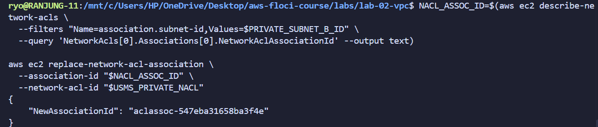

Then I have restored my normal identity and regenerated configs/lab-02.env, confirming that USMS_PRIVATE_SUBNET_B is populated. I did this because tempory credentials are evalated for the specific task and should not be used for other tasks, as a security best practice.

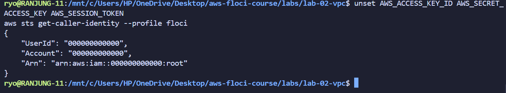

To catch the final verification, I have re-run the verify-lab-02.sh script and included the PASS line as evidence.

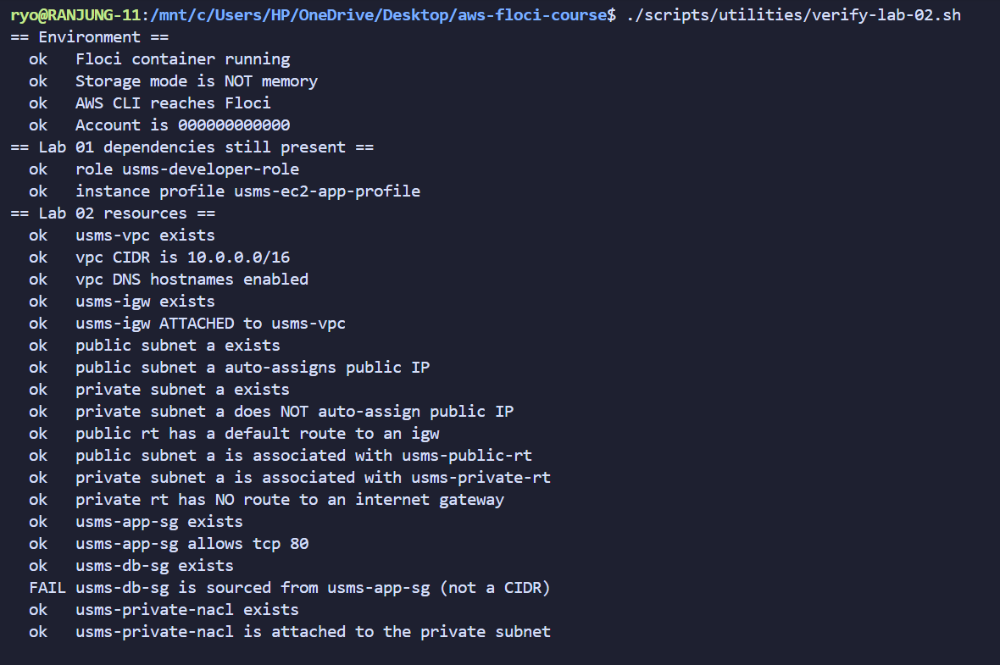
