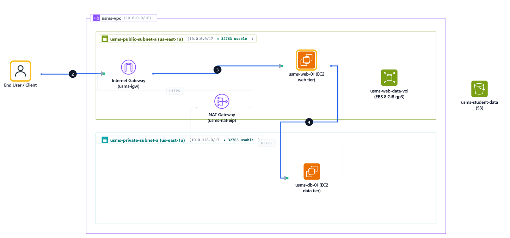
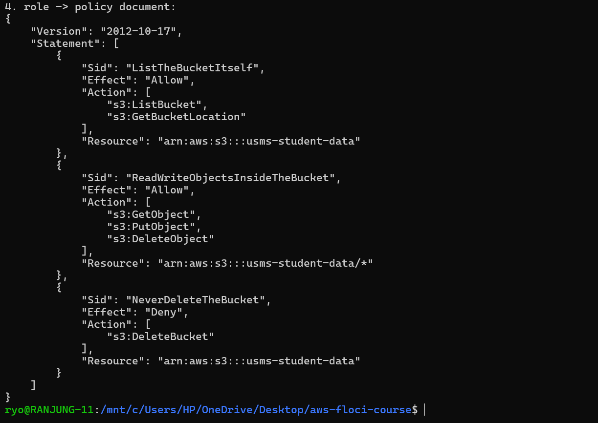

# Lab 03 Practical Report: Amazon EC2 and Deploying the USMS Application

## Aim / Objective

The aim of this lab is to deploy a two-tier version of the University Student Management System (USMS) on Amazon EC2 using the AWS CLI on the local emulator Floci. The specific objectives were to:

- Launch a web server instance into the public subnet built in Lab 02, using the security group from Lab 02 and the instance profile from Lab 01.
- Create an EC2 key pair, store the private key safely, and prove it is git-ignored.
- Start an instance with a user-data script and prove the script was stored correctly.
- Give the web server a fixed public address with an Elastic IP.
- Create and attach a separate EBS data volume.
- Launch a database instance into the private subnet with no public route and no instance profile.
- Prove that the setup survives a stop/start of the instance and a restart of Floci.
- Create a golden AMI from the configured web server.
- Check the whole lab with an automated verification script.

## Introduction

Amazon Elastic Compute Cloud (EC2) is the AWS service for virtual servers. Instead of buying and looking after physical machines, we can rent a server from AWS in a few minutes and pay only for the time we use it.

An EC2 instance is built from three main parts:

| Part | What it does |
|---|---|
| AMI (Amazon Machine Image) | The template that gives the operating system and the root disk |
| Instance type | Decides how much CPU and memory the server gets (for example `t3.micro`) |
| User data | A script that runs once when the server starts for the first time, used to set it up |

Other important EC2 features used in this lab are:

- **Key pairs**, used to log in to the server with SSH.
- **Security groups**, a firewall around each instance.
- **Elastic IP**, a public IP address that does not change.
- **EBS volumes**, extra disks that can be attached to an instance.
- **IAM instance profiles**, which give the instance temporary AWS credentials, so no access keys are saved on the server.

EC2 matters because almost every other compute service (Auto Scaling, load balancers, containers) is built on top of it.

This lab was done on **Floci**, a local AWS emulator. Floci stores the configuration of EC2 resources, but it does not really boot an operating system. Because of this, some things (such as opening the web page in a browser) cannot be tested here and are explained instead.

## Use Case

The university wants to run its Student Management System (USMS) on AWS in a safe way:

- **Web tier:** a web server (`usms-web-01`) in the public subnet that students and staff can reach from the internet.
- **Data tier:** a database server (`usms-db-01`) in the private subnet that cannot be reached from the internet. Only the web server should talk to it on the PostgreSQL port 5432.
- **Storage:** a separate data disk for the web server, so data is not lost if the server is replaced.
- **Golden AMI:** a saved image of the configured web server, so new identical servers can be started quickly later (for example by Auto Scaling).

Other common uses of EC2:

- Hosting web applications behind a load balancer.
- Running a self-managed database in a private subnet.
- Running batch jobs, build servers or bastion hosts only when needed.

## System Architecture / Design

**How it works in simple words:**

- Traffic from the internet comes through the internet gateway to the web server using its Elastic IP.
- The web server security group (`usms-app-sg`) allows HTTP on port 80.
- The database sits in the private subnet. Its route table only has a local route and a default route to the NAT gateway, so it can go out to the internet (for updates) but nobody from the internet can come in.
- The database security group (`usms-db-sg`) only allows port 5432.
- The web server has an instance profile that lets it read/write the `usms-student-data` S3 bucket. The database has **no** profile because it does not need any AWS permissions (least privilege).

## Implementation Procedure

### Step 1: Resume the environment and load three env files

This lab uses resources from Lab 01 (IAM) and Lab 02 (VPC). So first I started Floci and loaded the three env files (course, lab-01 and lab-02). Then I printed the values this lab needs: the subnet IDs, security group IDs, instance profile and Availability Zone. All of them had values, so I could continue.

### Step 2: Confirm Part A's network is intact

Before building on the network, I checked that it is still there and still correct, using the verification script from Lab 02. All checks returned `ok`, so the VPC, subnets, route tables and security groups from Lab 02 were all present.

### Step 3: Choose an AMI

I listed the AMIs owned by Amazon in Floci. Floci already has a few sample images (Amazon Linux 2, Amazon Linux 2023, Debian, Alpine and Windows).

I used **the first option**: I took the first image from the list, `ami-0abcdef1234567890` (Amazon Linux 2). I chose this because Floci already had images, so I did not need to register my own image or use a placeholder ID. On real AWS, the best way is to get the latest Amazon Linux AMI ID from an SSM public parameter, because AMI IDs change between regions and over time.

### Step 4: Create the key pair and store the private key safely

I created an RSA key pair named `usms-app-key` and saved the private key straight into `outputs/usms-app-key.pem`. Then I changed the file permission to `600` (`-rw-------`), so only my user can read it. AWS shows the private key only once, so if it is lost it cannot be downloaded again.

### Step 5: Prove the private key is git-ignored

A private key must never be pushed to GitHub. I used `git status` and `git check-ignore` to prove that the `outputs/` folder is ignored by `.gitignore`, so the `.pem` file will never be committed.

### Step 6: Write the user-data bootstrap script

I wrote `user-data.sh`. This script runs **once**, as root, when the instance starts for the first time. It:

1. Updates the system and installs nginx.
2. Asks the instance metadata service (using the secure IMDSv2 token) for the instance ID, Availability Zone and private IP.
3. Creates a simple USMS web page (`index.html`) showing those values.
4. Creates a `health.json` file so health checks can read the status easily.
5. Starts nginx.

I checked the script with `bash -n` (syntax OK) and made sure it is under the 16 KB user-data limit.

### Step 7: Generate a request skeleton and fill it in

Instead of writing a very long `run-instances` command, I asked the CLI to generate an empty JSON skeleton to see the shape of the request. Then I wrote my own request file `templates/lab-03-run-instances.json` with the AMI, instance type, key pair, subnet, security group, instance profile and tags. I checked it was valid JSON.

Command: part 1, look at the shape

Command: part 2, write the request we actually want

### Step 8: Launch the USMS web server

I launched `usms-web-01` using the JSON file and passed the user-data script with `--user-data file://`. The command returned the new instance ID, which I saved in `WEB_INSTANCE_ID`.

### Step 9: Wait for the instance to reach running

I used `aws ec2 wait instance-running`. This command keeps checking every 15 seconds until the instance is running, so I did not have to keep checking by hand.

### Step 10: Read the instance back and understand the fields

I read the instance back with a JMESPath query to show the important fields:

| Field | Value | Meaning |
|---|---|---|
| State | running | The instance is up |
| Type | t3.micro | Small, cheap instance type |
| AZ | us-east-1a | Same AZ as the public subnet |
| Subnet | subnet-d65d69cb | `usms-public-subnet-a` |
| PrivateIP | 172.19.0.3 | Address inside the VPC (Floci gives a Docker-style address) |
| PublicIP | 127.0.0.1 | Floci uses loopback instead of a real public IP |
| Profile | usms-ec2-app-profile | IAM permissions from Lab 01 |
| SG | usms-app-sg | Web firewall from Lab 02 |
| Key | usms-app-key | Key pair from Step 4 |

### Step 11: Trace the permission chain from the instance to the policy

I followed the chain: **instance → instance profile → role → policy**. The instance uses `usms-ec2-app-profile`, which contains the role `usms-ec2-app-role`, which has the policy `USMSStudentDataReadWrite` attached.

The policy allows listing the `usms-student-data` bucket, allows reading, writing and deleting objects inside it, and **denies** deleting the bucket itself. I saved it to `outputs/lab-03-instance-policy.json`.

**Why a policy can allow access to a bucket that does not exist yet:** An IAM policy only matches names (ARNs) as text. AWS does not check whether the bucket exists when the policy is created. It only checks the policy when a request is made, so the permission is ready and will start working as soon as the bucket is created.

### Step 12: Prove the user data actually arrived

I read the user data back from the instance with `describe-instance-attribute --attribute userData`. AWS stores it in base64, so I decoded it and compared it with my `user-data.sh` file using `diff`. There was no difference, so the result was `USER DATA PROVEN`. This means the exact script I wrote is stored on the instance.

<!-- Screenshot for Step 12 was not captured. Add it here as assets/12.png if available. -->

### Step 13: Give the web server a stable public address

The public IP that AWS gives automatically **changes** when the instance is stopped and started. So I allocated an Elastic IP (`usms-web-eip`) and associated it with the web server. An Elastic IP stays the same until I release it, so a DNS record can safely point to it.

Verify

### Step 14: Test the application

I tried to open the web page and `health.json` with `curl`. On Floci the connection timed out. This is **expected**, because Floci does not really boot the server, so nginx is not running.

Command: fallback, prove every link in the chain

Since I could not test with a browser, I checked every link that must be correct for a request to reach the server:

| # | Check | Result |
|---|---|---|
| 1 | Is the instance running? | running |
| 2 | Does the subnet's route table go to an internet gateway? | igw-9af7d3de |
| 3 | Is the internet gateway attached to the VPC? | available |
| 4 | Does the security group allow TCP 80 from the internet? | 0.0.0.0/0 |
| 5 | Does the instance have a public address? | 127.0.0.1 (Floci) |
| 6 | Does the NACL allow it? | default NACL (allows all) |

The seventh link is **the application itself (nginx) actually running on the server**. This is the one link Floci cannot prove.

### Step 15: Create and attach a data volume

I created an 8 GiB `gp3` volume called `usms-web-data-vol` in the **same AZ** as the web server (`us-east-1a`) and attached it as `/dev/sdf`. An EBS volume can only be attached to an instance in the same Availability Zone.

Verify

The result shows the data volume `/dev/sdf` has `DeleteOnTermination = False`, so it will survive if the server is terminated. The root volumes (`/dev/xvda`) have `True`, so they are deleted with the instance.

If I attached a volume from `us-east-1b` to an instance in `us-east-1a`, real AWS would reject it with an `InvalidVolume.ZoneMismatch` error. Floci may allow it because it does not fully check AZ rules.

### Step 16: Launch the database-tier instance into the private subnet

I launched `usms-db-01` into `usms-private-subnet-a` with the `usms-db-sg` security group and tags (`Tier=data`). I did **not** give it an instance profile.

The output shows `Profile = None` and the security group is `usms-db-sg`. The public address shows `127.0.0.1`, which is Floci's loopback value, not a real public IP. The private subnet does not auto-assign public IPs.

**Why no instance profile:** the database does not need to call any AWS service. Giving it no permissions follows the principle of least privilege. If someone breaks into the database server, they get no AWS credentials.

### Step 17: Prove the two tiers are wired the way you think

I checked how the two tiers connect:

- `usms-web-01` uses `usms-app-sg` in the public subnet, and `usms-db-01` uses `usms-db-sg` in the private subnet.
- `usms-db-sg` allows port **5432**.
- The private route table has `10.0.0.0/16 → local` and `0.0.0.0/0 → NAT gateway`. There is no route to the internet gateway, so the database cannot be reached from the internet.

The check printed `MISMATCH` because Floci returned `None` as the source group of the 5432 rule, even though the rule exists. The rule in Lab 02 was created to allow traffic from the web security group, but Floci does not show the group in this field.

**Why a rule based on a security group ID is safer than a CIDR rule:** a security group rule allows only instances that carry that group, even if their IP addresses change. A CIDR rule allows every IP in that range, including other machines that are not the web server.

**Why the NAT route is outbound only:** a NAT gateway only lets the private instance start connections out to the internet (for example to download updates). It does not accept new connections coming in from the internet.

### Step 18: Stop and start the web server, and watch which address moves

I stopped and started the web server and compared the addresses before and after:

- The private IP stayed the same (`172.19.0.3`).
- The Elastic IP `54.195.165.138` stayed associated with the same instance.

On real AWS, the **auto-assigned public IP would change** after a stop/start, but the Elastic IP stays. That is why a DNS record pointing to the auto-assigned IP would break, and why we use an Elastic IP. On Floci the public IP stayed `127.0.0.1` because Floci uses loopback.

### Step 19: Prove persistence across a restart

#### Part 1: record the state

I saved the list of running USMS instances, their subnets and security groups to `outputs/lab-03-pre-restart.txt`.

#### Part 2: restart Floci

I stopped and started Floci.

#### Part 3: read it back by tag, not by variable

After the restart I searched for the instances by their `Project=USMS` tag (not by the old shell variables) and saved the result to `outputs/lab-03-post-restart.txt`. `diff` found no difference, so the result was `PERSISTENCE PROVEN`. The volume count was 1 and the Elastic IP count was 2 (web EIP and NAT EIP).

### Step 20: Create an AMI from the configured instance

I created a golden AMI from `usms-web-01` using `--no-reboot`. The image `usms-web-golden-20261003` (`ami-ea28557bf0bebffa8`) reached the `available` state and is private (`Public = False`).

**User data vs golden AMI:**

| | User data | Golden AMI |
|---|---|---|
| Boot time | Slower, installs software at every new launch | Faster, software is already installed |
| Patching | Always gets latest packages | Need to rebuild the AMI to patch |
| Auditability | Easy to read the script | Harder to see what is inside the image |
| Failure | Can fail at boot if a download fails | Fails at build time, so boots are reliable |

### Step 21: Audit what this lab created

I listed everything the lab created: the instances, the data volume, the Elastic IPs and the AMI. Some older `usms-web-01` instances are `terminated` because I relaunched the web server during the lab. The running ones are `usms-web-01`, `usms-web-02` (from the exercises) and `usms-db-01`.

### Step 21 "Your turn": exposure report

I wrote a query that lists every running USMS instance with its AZ and public address and saved it to `outputs/lab-03-exposure-report.txt`. On Floci every instance shows `127.0.0.1` because Floci uses loopback. On real AWS, `usms-db-01` would show `NO PUBLIC ADDRESS`.

### Step 22: Write configs/lab-03.env

I saved the important IDs (instance IDs, volume ID, Elastic IP, AMI ID) to `configs/lab-03.env` so the next lab can load them.

### Step 23: Commit

I committed the lab files to Git. The private key is not included because `outputs/` is git-ignored.

### Verification

I ran `verify-lab-03.sh`. The result was **PASS=36, FAIL=1**. All Lab 03 checks for the web tier, storage, data tier, image, tagging and Git hygiene passed. The one failed check is above the part shown in the screenshot; it is most likely the same Floci issue seen in Step 17, where the database security group rule shows `None` as its source group.

## Analysis and Discussion

- **Everything was proven by reading back.** For each resource, I did not just trust the create command. I read the configuration back (`describe-*`) to make sure it was correct. This is a good habit because a command can succeed but still create something wrong.
- **Public vs private tier.** The web server is in the public subnet with an Elastic IP. The database is in the private subnet with no route from the internet. This keeps the database safe even if a security group is configured wrongly.
- **Least privilege.** Only the web server got an instance profile. Its policy only allows the `usms-student-data` bucket and even denies deleting it. The database has no AWS permissions at all.
- **Elastic IP.** The stop/start test showed why a fixed address matters. A DNS name pointed at an auto-assigned IP would break after a restart.
- **EBS.** The data volume has to be in the same AZ as the instance, and it is kept after the instance is terminated, while the root disk is deleted.
- **Floci limitations.** Floci saves the configuration but does not run a real operating system. Because of this:
  - nginx never ran, so `curl` timed out (Step 14).
  - Public IPs show as `127.0.0.1` and private IPs are Docker addresses.
  - Security groups are not enforced, so I could only show the rules, not test them.
  - The security group source for port 5432 showed `None` (Step 17), which caused one check to fail.

  On real AWS these would behave differently, so I explained the expected AWS behaviour where Floci could not show it.

## Reflection

This lab helped me understand how the IAM work from Lab 01 and the network from Lab 02 come together when a real server is launched. Before this lab I thought launching a server was just one command, but I learned that many parts must be correct at the same time: the AMI, subnet, security group, route table, internet gateway, instance profile and key pair.

The hardest part was that I could not open the web page on Floci. At first it looked like something was wrong, but I learned to check each link in the chain instead. The `MISMATCH` in Step 17 and the one failed check in the verification also taught me that an emulator does not always behave like real AWS, so it is important to understand *why* something fails and not just whether it passed.

I also learned to keep secrets safe (the `.pem` file stays in a git-ignored folder) and to search for resources by tags instead of shell variables, because variables are lost when the terminal closes.

## Conclusion

In this lab I deployed a two-tier USMS application on EC2 using the AWS CLI. The objectives were achieved: the web instance, database instance, key pair, Elastic IP, data volume and golden AMI were created in the correct subnets with the correct security groups and instance profile, and each one was proven by reading the configuration back. The verification script passed 36 of 37 checks, and the one failure is related to how Floci reports security group rules.

The key concepts I learned are the AMI / instance type / user data model, the difference between an auto-assigned IP and an Elastic IP, the Availability Zone rule for EBS volumes, least privilege (the database has no instance profile), and the chain of settings that must all be correct for a request to reach an instance. The skills I practised include CLI automation with JMESPath queries, JSON request templates, waiters, persistence testing and writing verification checks. EC2 is important because most other AWS services are built on top of it, so understanding it will make load balancing, Auto Scaling and containers (Lab 04) easier to learn.
