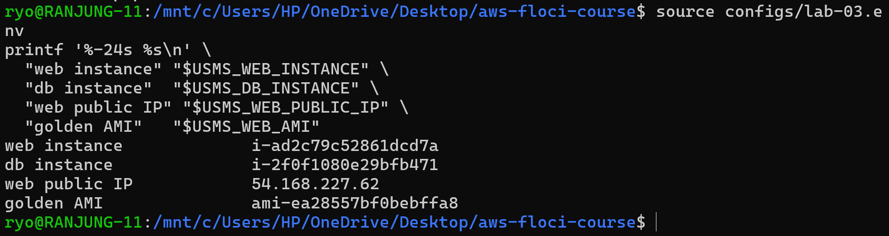
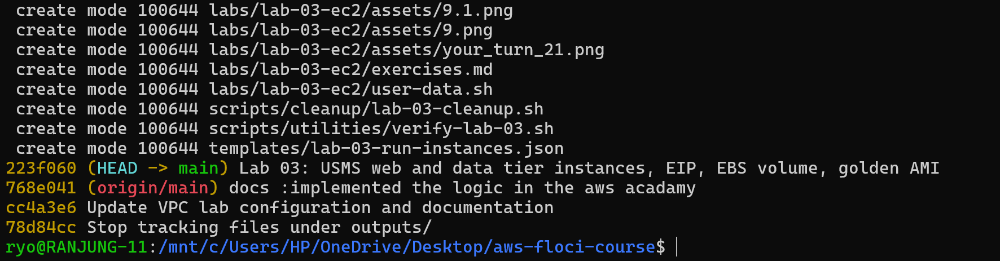
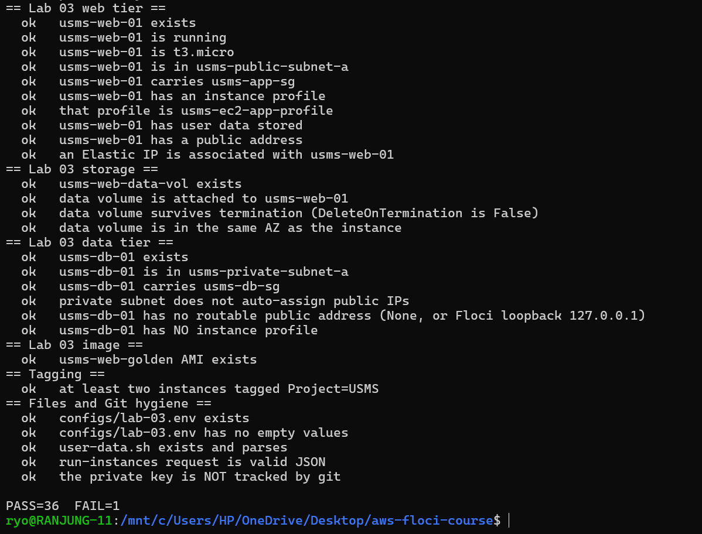

## Aim / Objective

To deploy a two-tier version of the University Student Management System (USMS) on Amazon EC2 using the AWS CLI. The specific objectives were to:

- Launch a web server instance into the public subnet built in Lab 02, using the security group from Lab 02 and the instance profile from Lab 01.
- Create an EC2 key pair, store the private key safely, and prove it is git-ignored.
- Bootstrap an instance with a user-data script and prove the script was stored intact.
- Give the web server a stable public address with an Elastic IP.
- Create and attach a separate EBS data volume.
- Launch a database-tier instance into the private subnet with no public route and no instance profile.
- Prove that the configuration survives a stop/start of the instance and a restart of the emulator.
- Verify the whole lab with an automated script.

## Introduction

Amazon Elastic Compute Cloud (EC2) is AWS's virtual server service. It lets a user rent resizable compute capacity on demand instead of buying and maintaining physical hardware. An instance is built from three parts: an Amazon Machine Image (AMI) that supplies the operating system and root disk, an instance type that defines the CPU and memory, and optional user data that configures the server at first boot. Key features include choice of instance families, Elastic Block Store (EBS) volumes for durable storage, security groups for instance-level firewalling, Elastic IP addresses for stable public addressing, key pairs for SSH access, and IAM instance profiles that give an instance temporary credentials without storing keys on disk. EC2 is the foundation of most compute workloads on AWS: web and application servers, databases, batch processing and the base layer for Auto Scaling and container platforms. It is important in cloud computing because it provides elastic, pay-as-you-go infrastructure that can be scaled up or down in minutes.

## Use Case

- Hosting scalable web applications, such as the USMS student portal, behind a load balancer.
- Running a self-managed database tier in a private subnet that only the web tier can reach.
- Creating golden AMIs that Auto Scaling groups use to launch identical servers quickly.
- Running batch jobs, build servers or bastion/maintenance hosts that are started only when needed.

## System Architecture / Design

## Implementation Procedure

### Step 1: Resume the environment and load three env files

The lab consumes the value of the two previous labs. So, firstly, I have resumed the environment and loaded the three env files.

Started the floci environment.

### Step 2: Confirm Part A's network is intact

Before bulding on the network, I have checked if it is still there and still correct, using the verification script from Lab 2.

### Step 3: Choose an AMI

### Step 4: Create the key pair and store the private key safely

### Step 5: Prove the private key is git-ignored

### Step 6: Write the user-data bootstrap script

### Step 7: Generate a request skeleton and fill it in

Command: part 1, look at the shape

Command: part 2, write the request we actually want

### Step 8: Launch the USMS web server

### Step 9: Wait for the instance to reach running

### Step 10: Read the instance back and understand the fields

### Step 11: Trace the permission chain from the instance to the policy

### Step 12: Prove the user data actually arrived

### Step 13: Give the web server a stable public address

Verify

### Step 14: Test the application

Command: fallback, prove every link in the chain

### Step 15: Create and attach a data volume

Verify

### Step 16: Launch the database-tier instance into the private subnet

### Step 17: Prove the two tiers are wired the way you think

### Step 18: Stop and start the web server, and watch which address moves

  

### Step 19: Prove persistence across a restart

#### Part 1: record the state

#### Part 2: restart Floci

#### Part 3: read it back by tag, not by variable

### Step 20: Create an AMI from the configured instance

### Step 21: Audit what this lab created

### Step 21 "Your turn": exposure report

### Step 22: Write configs/lab-03.env

### Step 23: Commit

### Verification

## Analysis and Discussion

## Reflection

## Conclusion

This practical deployed a two-tier USMS application on EC2 using the AWS CLI. The objectives were achieved: the web instances, database instance, key pair, Elastic IP, data volume and AMI record were created in the right subnets with the right security groups and instance profile, and each property was proven by reading the configuration back. 

Key concepts learned include the AMI/instance type/user data model, the difference between auto-assigned and Elastic IP addresses, the Availability Zone constraint on EBS volumes, least privilege (the database tier has no instance profile), and the layered path that must be correct for a request to reach an instance. Skills developed include CLI automation with JMESPath, JSON request templates, waiters, persistence testing and writing honest verification checks. EC2 matters because it is the base compute layer on which most other AWS services and architectures are built, and understanding it makes load balancing, Auto Scaling and container platforms easier to learn.