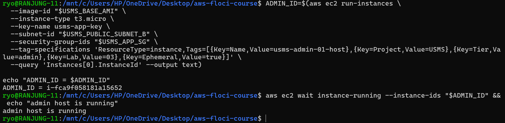
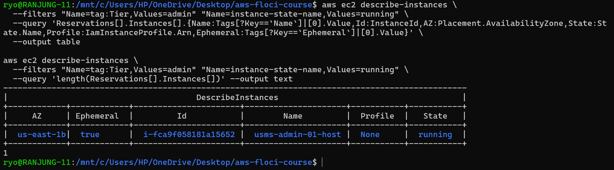
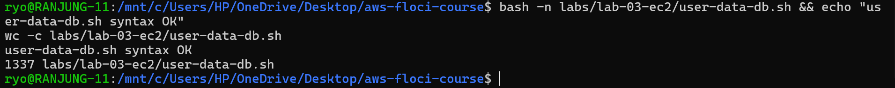
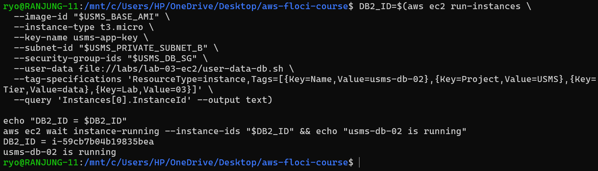
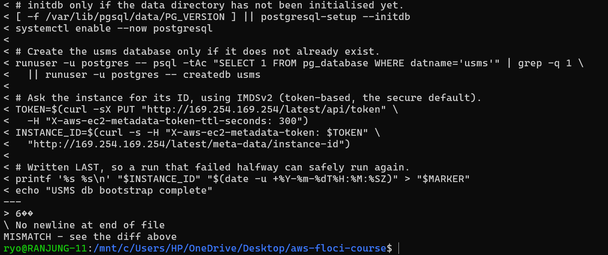
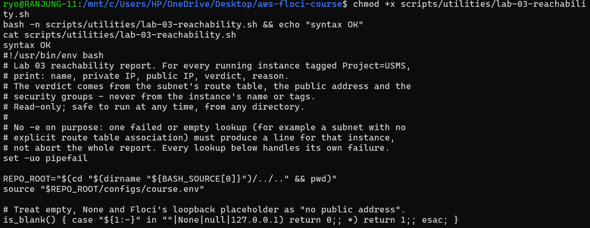
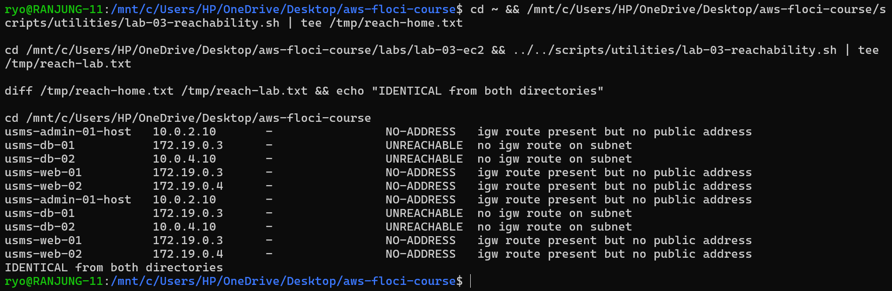
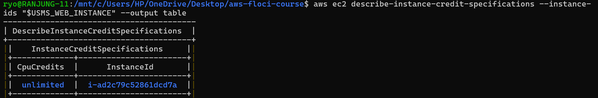
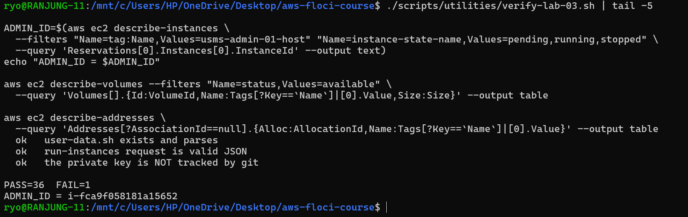
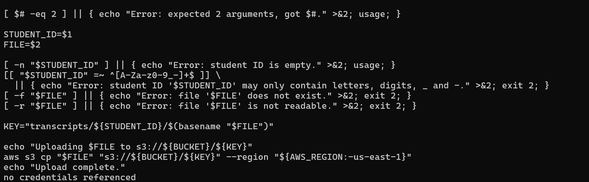

# Lab 03 Independent Exercises

## Exercise 1 - Basic: A Maintenance Instance

### Task

Launch a small admin host called `usms-admin-01-host` in `usms-public-subnet-b`. It uses the `usms-app-key` key pair and the `usms-app-sg` security group, and has **no** instance profile. It is tagged `Project=USMS`, `Tier=admin`, `Lab=03` and `Ephemeral=true`.

Then I waited for it with a **waiter** instead of `sleep`. The waiter keeps checking until the instance is running:

### Verification

### Result

The filter `Tier=admin` returned exactly **one** running instance:

| Field | Value |
|---|---|
| Name | usms-admin-01-host |
| Instance ID | i-fca9f058181a15652 |
| Type | t3.micro |
| AZ | us-east-1b |
| Instance profile | None |

- The host has **no instance profile**, because an admin host does not need to call AWS services. Giving it no permissions follows least privilege.
- I did **not** save it in `configs/lab-03.env`, because it is a temporary host (`Ephemeral=true`) and it is deleted in Exercise 4.

---

## Exercise 2 - Intermediate: A Self-Describing Bootstrap

### Task

Write a user-data script for the database tier that:
- installs PostgreSQL,
- creates a database called `usms`,
- writes a marker file `/var/log/usms-db-bootstrap.done` with the instance ID and the UTC time,
- does nothing if it runs a second time.

Then launch `usms-db-02` with it and prove that EC2 stored exactly the same script.

### Step 1: Write the script

I wrote `labs/lab-03-ec2/user-data-db.sh` using a **quoted** heredoc (`'EOF'`):

**Why the heredoc is quoted:** quoting `'EOF'` stops my own terminal from replacing `$MARKER`, `$TOKEN`, `$INSTANCE_ID` and `$(date ...)` while writing the file, so they are saved as plain text and only get their real values later, on the instance, when it boots.

**How the script avoids running twice:**
- **The marker check at the top:** if `/var/log/usms-db-bootstrap.done` exists, the script prints the old marker and exits with `0` without changing anything.
- **The marker is written last:** if a run fails halfway, there is no marker, so the next run tries again.
- **Each setup step checks first:** `initdb` and `createdb` only run if needed, so a half-finished run does not cause errors the second time.

### Step 2: Check syntax and size before launching

The syntax check passed and the script is **1,337 bytes**, which is far below the 16 KB (16,384 bytes) user-data limit.

### Step 3: Launch usms-db-02 in usms-private-subnet-b

`usms-db-02` runs in `us-east-1b` with the `usms-db-sg` security group and, like `usms-db-01`, has **no instance profile**.

### Step 4: Prove the stored user data is the same (Step 12 technique)

EC2 stores user data in base64. I downloaded it, decoded it and compared it with my file. `diff` printed nothing and the result was `USER DATA PROVEN`, so the instance holds exactly the script I wrote.

### When could the script run a second time?

Normally cloud-init runs user data **only once per instance**, so the marker check may look unnecessary. A second run can still happen when:

1. **Someone runs it by hand** to fix something, for example `sudo bash /var/lib/cloud/instance/scripts/part-001`.
2. **cloud-init is reset** with `cloud-init clean`, so the next boot looks like the first boot.
3. **A golden AMI is made from this server.** A new instance from that AMI has a new instance ID, so cloud-init runs the user data again. The marker file is copied inside the image, so the script sees it and stops. The marker also shows the **old** instance ID, which tells us the server was copied.
4. **User data is set to run on every boot** in the cloud-init settings.

On Floci the script never actually runs, because Floci does not boot a real operating system. Only the stored copy can be checked.

---

## Exercise 3 - Problem Solving: A Reachability Report

### Task

Write `scripts/utilities/lab-03-reachability.sh`. For every running instance tagged `Project=USMS`, it prints one line saying whether the instance can be reached from the internet on port 80. The answer must come from the **route table** and the **security group**, never from the instance's name or tags.

### How the script decides

For each instance the script checks three things in order:

| Check | If the check fails | Verdict |
|---|---|---|
| 1. Does the subnet's route table send `0.0.0.0/0` to an internet gateway (`igw-...`)? If the subnet has no route table of its own, the VPC's main route table is used. | No internet gateway route | `UNREACHABLE` |
| 2. Does the instance have a public address? An associated Elastic IP counts. `None` and Floci's placeholder `127.0.0.1` do not. | Internet gateway route, but no address | `NO-ADDRESS` |
| 3. Does one of its security groups allow TCP 80 (or all traffic) from `0.0.0.0/0`? | Port 80 not allowed | `BLOCKED` |
| All three checks pass | | `REACHABLE` |

**Why NO-ADDRESS is a separate verdict:** the subnet *does* have a route to the internet, so the instance is not unreachable for the same reason as the database. It only has no public address for traffic to arrive on. Adding an Elastic IP would fix it. A database in a private subnet would need its routing changed, which is a much bigger change.

### Design decisions

- **`set -uo pipefail` without `-e`:** if one lookup fails (for example a subnet without its own route table), the script should still print a line for that instance instead of stopping the whole report. Every lookup handles its own failure. This is explained in a comment in the script.
- **Runs from any directory:** the script finds the repo folder from its own location (`BASH_SOURCE`), so it does not depend on where it is started.
- **No hard-coded IDs:** it finds the instances by the `Project=USMS` tag and looks up everything else from them.
- **Missing fields do not crash it:** every value is checked for `None` or empty before it is used.
- **The Elastic IP is checked by association:** after a restart, Floci shows every Elastic IP as `127.0.0.1`, so the script checks whether an Elastic IP is **attached** to the instance instead of trusting the IP text.

### Commands

I ran it from my home folder and from the lab folder, then compared the two outputs:

Both runs printed the same five lines, so the script works from any directory. Every instance was classified, including the ones from Exercises 1 and 2:

- **`usms-web-01` is REACHABLE:** its subnet routes to the internet gateway, it has the Elastic IP `usms-web-eip` attached (marked `(eip)`), and `usms-app-sg` allows port 80 from anywhere.
- **`usms-db-01` and `usms-db-02` are UNREACHABLE:** the private route table only sends internet traffic to the NAT gateway, never to the internet gateway.
- **`usms-admin-01-host` and `usms-web-02` are NO-ADDRESS:** their public subnets do route to the internet gateway, but they have no Elastic IP, and Floci only gives them the placeholder `127.0.0.1`. On real AWS the public subnet would give them a public IP automatically, and they would show REACHABLE.

### Problem I found

At first `usms-web-01` showed NO-ADDRESS. I found two causes:

1. **Floci's placeholder IP:** after the restart, Floci showed the Elastic IP as `127.0.0.1`, and the script ignored it. I changed the script to check whether an Elastic IP is attached, not what IP it shows.
2. **The wrong Elastic IP was attached:** during the lab, `usms-nat-eip` (the NAT gateway's address from Lab 02) had been attached to `usms-web-01`, and `configs/lab-03.env` saved it as the web server's Elastic IP. I detached `usms-nat-eip` from the web server and fixed `USMS_WEB_EIP_ALLOC` to point to the real `usms-web-eip` (`eipalloc-06006caa653d9d03e`). On real AWS this mistake would have broken internet access for the private subnet, because the NAT gateway would have lost its public address.

---

## Exercise 4 - Challenge: Right-Size and Clean Up

### Task

The project lead says the portal has **400 users at midday**, mostly reading. The single `t3.micro` runs at **85% CPU at midday** and is idle at night. Finance thinks EC2 costs too much. I need to decide what to change, what it would cost, and what to delete today.

### Step 1: Check the CPU credit setting

The result is `CpuCredits = unlimited` for `usms-web-01`. This is the default for T3 instances, and it is the setting that decides what happens at 85% CPU.

### What are burstable CPU credits?

A **t3** instance does not get full CPU power all the time. It gets a small **baseline**, and it earns **CPU credits** while it runs below that baseline. One credit means one vCPU running at 100% for one minute.

- **`t3.micro`:** 2 vCPUs with a baseline of **10% each**, so it earns **12 credits per hour** (0.10 × 2 × 60).
- **Running above the baseline:** it spends credits faster than it earns them.

**Why 85% is a problem for a t3:** at 85% the instance uses 1.7 vCPUs, which is **102 credits per hour**, but it only earns 12. What happens next depends on the credit setting:

- **`standard` mode:** the credits run out and AWS **slows the CPU down to 10%**. The portal would become very slow exactly at midday, when 400 users need it.
- **`unlimited` mode** (our setting): the CPU never slows down, but AWS **quietly charges extra** at **$0.05 per vCPU-hour** whenever the 24-hour average is above the baseline.

**The hidden cost today** (assuming 6 busy hours a day at 85% and idle the rest):

- **24-hour average CPU:** (6 × 85%) ÷ 24 = **21.25%**, which is above the 10% baseline.
- **Extra CPU used:** (21.25% − 10%) × 2 vCPUs × 24 hours = **5.4 vCPU-hours per day**.
- **Extra cost:** 5.4 × $0.05 = **$0.27 per day ≈ $8.10 per month**.

This is more than the instance itself costs ($7.59), and nobody sees it unless they look for it.

### Scale up or scale out?

| | Scale **up** (bigger instance) | Scale **out** (more instances + load balancer) |
|---|---|---|
| What it means | Replace `t3.micro` with a bigger size | An Auto Scaling group of `t3.micro` behind an Application Load Balancer |
| Midday peak | `t3.small` and `t3.medium` still have only **2 vCPUs**, so the same work still uses about 85%. They only have a higher baseline (20%). Getting more real CPU needs `t3.xlarge` (4 vCPUs). | 4 instances share the work, so each runs at about **21%** |
| At night | **Pays full price all night** | Shrinks back to the minimum (2 instances), so it costs less at night |
| If a server fails | Only one server, so the portal goes down | 2 or more servers in 2 AZs, so the portal stays up |

### Monthly cost comparison

**Prices:** AWS public price pages for **us-east-1, Linux, On-Demand**, with 730 hours in a month:

| Service | Price | Source |
|---|---|---|
| EC2 instances | t3.micro $0.0104/h, t3.medium $0.0416/h; T3 unlimited extra credits $0.05 per vCPU-hour | https://aws.amazon.com/ec2/pricing/on-demand/ |
| Application Load Balancer | $0.0225/h + $0.008 per LCU-hour | https://aws.amazon.com/elasticloadbalancing/pricing/ |
| EBS gp3 | $0.08 per GB-month | https://aws.amazon.com/ebs/pricing/ |
| Public IPv4 address | $0.005/h | https://aws.amazon.com/vpc/pricing/ |

| Cost item | **Today:** 1 × t3.micro | **Option A:** scale up to 1 × t3.medium | **Option B:** scale out, ALB + 2–4 × t3.micro |
|---|---|---|---|
| Instances | 730 h × $0.0104 = **$7.59** | 730 h × $0.0416 = **$30.37** | (2 × 730 h + 2 × 6 h × 30 days) = 1,820 h × $0.0104 = **$18.93** |
| Extra CPU credits | **$8.10** | 21.25% vs 20% baseline = 0.6 vCPU-h/day = **$0.90** | each server averages about 7%, under its baseline = **$0.00** |
| EBS disks (8 GiB gp3) | root + data = **$1.28** | root + data = **$1.28** | 2 roots + data ≈ **$1.92** |
| Load balancer | – | – | $16.43 + about 1 LCU ($5.84) = **$22.27** |
| Public IPv4 | 1 × $3.65 = **$3.65** | 1 × $3.65 = **$3.65** | 2 load balancer IPs × $3.65 = **$7.30** |
| **Total per month** | **≈ $20.62** | **≈ $36.20** | **≈ $50.42** |

### My recommendation

- **Tell Finance the real number first:** today's EC2 line is not $7.59. With the hidden credit charge it is about **$15.69** for the instance alone.
- **Quick, cheap step:** moving to `t3.small` ($15.18 + $0.90 in credits ≈ $16.08) costs almost the same as today, but makes the bill predictable. It does **not** add CPU power or protect against a failure.
- **Proper fix: scale out (Option B).** It costs more (≈ $50 vs ≈ $21 per month), but the midday users get enough capacity, the portal keeps running if one server fails, and the extra servers are turned off at night. Option A costs ≈ $36 and still leaves one server at 85% at midday (same 2 vCPUs), paying full price at night, so it is not worth it.
- **Delete waste today** (next section), so Finance pays nothing for resources nobody uses.

### What to delete today

First I checked the verification script and listed what can be deleted. Nothing listed below is in the lab's KEEP list (`usms-web-01`, `usms-db-01`, `usms-web-eip`, `usms-web-data-vol`, `usms-web-golden`, `usms-app-key`, and everything from Labs 01 and 02).

- **Admin host:** `usms-admin-01-host` (`i-fca9f058181a15652`) from Exercise 1 is still running.
- **Orphaned volumes:** none. Every volume is attached to an instance.
- **Unassociated Elastic IPs:** only `usms-nat-eip`, which became unattached when I detached it from the web server in Exercise 3. It belongs to the Lab 02 NAT gateway, which is on the KEEP list, so it must **not** be released.

The deletions were done in **dependency order**:
1. **The instance first:** terminating it also deletes its root volume, and frees anything attached to it.
2. **Then volumes:** so any volume freed in step 1 is caught.
3. **Then Elastic IPs:** they do not depend on anything else here.

---

## Exercise 5 - Integration: Prepare the S3 Hand-Off for Lab 4

### Task

Lab 4 creates the S3 bucket `usms-student-data`. The IAM policy `USMSStudentDataReadWrite` has allowed access to this bucket since Lab 1. In this exercise I prepared everything on the EC2 side, so that once Lab 4 creates the bucket, the web server can use it right away.

### Step 1: The upload script

I wrote `labs/lab-03-ec2/transcript-upload.sh`. It is meant to run **on `usms-web-01`**. It takes a student ID and a file, and uploads the file to `s3://usms-student-data/transcripts/<student-id>/<filename>`.

- **No credentials in the script:** the AWS CLI on the instance gets temporary credentials automatically from the instance profile `usms-ec2-app-profile`.
- **Checks its inputs:** if an argument is missing or wrong, it prints a usage message and exits with code `2`.

**Result:**
- **No credentials:** `grep` found nothing, so the script contains no keys at all.
- **Input checks:** all three wrong calls were rejected with a clear message and `exit code: 2`:
  - no arguments → `expected 2 arguments, got 0`
  - one argument → `expected 2 arguments, got 1`
  - missing file → `file 'nofile' does not exist`

